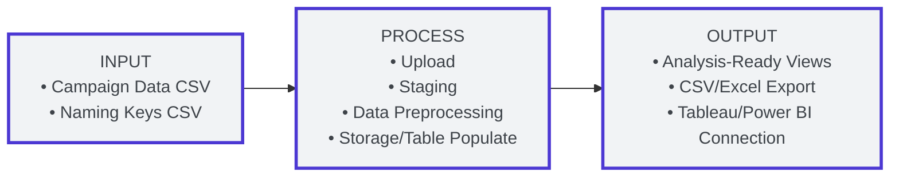
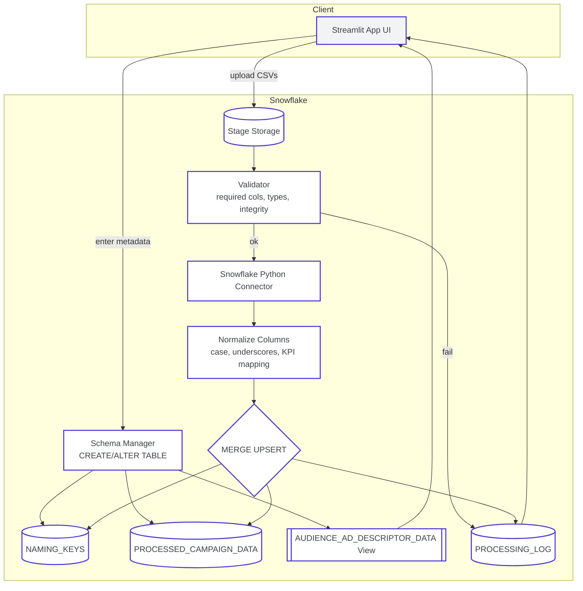
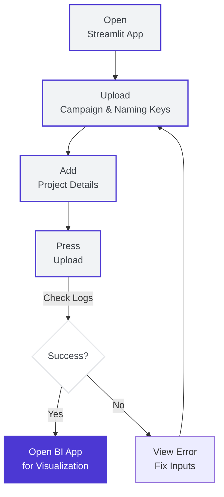

# Spark No. 9 Data Pipeline - Campaign Data Processing

*Updated October 13, 2025 - Data Pipeline Documentation*

---

## Executive Summary

This document provides a detailed data pipeline specification for Spark No. 9's campaign data processing system, designed to automate the critical bottleneck identified in their current workflow. The pipeline addresses the 8-15 hours per wave spent on manual data processing, reducing it to within 1 hour while maintaining data quality and preparing data for visualization.

**Key Innovation**: Automated CSV processing pipeline with dynamic table structure updates, eliminating manual data cleaning, script modifications, and view creation that currently consume 40-60% of project time.

## 1. System Architecture Overview

Overview of how campaign files move from upload to analysis-ready data, including the high-level components, the end-to-end processing flow, and the supporting technology stack.

### 1.1 High-Level Architecture

The system architecture consists of three main phases:

#### INPUT
Two CSV files are provided by the user:
- Campaign Data CSV with performance metrics
- Naming Keys CSV with ad taxonomy

#### PROCESS
Data flows through four stages within Snowflake via the Streamlit UI:
- Upload: Submit campaign CSV and naming keys via the app.
- Staging: Store raw files in Snowflake stage for backup and audit.
- Data Preprocessing: Normalize columns, data types, and KPI names.
- Storage/Table Populate: Upsert into target tables and refresh analysis views.

#### OUTPUT
Processed data is made available in three formats:
- Analysis-Ready Views
- CSV/Excel Export
- Tableau/Power BI Connection

---

### 1.2 End-to-End Processing Flow

The data processing pipeline follows a structured workflow:

1. **CSV File Upload** → **File Validation** → **Metadata Extraction** → **File Renaming**
2. **Stage Upload** → **Table Structure Update** → **Data Processing** → **Table Population**
3. **Processing Log** → **Success Notification**

Error handling path: **Error Detection** → **Error Logging** → **User Notification**

### 1.3 Technology Stack

**Frontend**: Streamlit (Python web framework) \- Hosted in Snowflake

**Backend**: Python using Snowflake Connector

**Database**: Snowflake Data Warehouse

**File Processing**: Pandas for CSV handling and data preprocessing

**Deployment**: Snowflake-hosted Streamlit application with SnowCLI deployment

**Output**: Data prepared for visualization

**Architecture**: Modular Python components following Snowflake best practices

## 2. User Workflow

How an analyst interacts with the application to upload files, trigger processing, and access results. Focuses on the minimum sequence of actions to move data from upload to visualization.

### 2.1 App Usage Flow

The user journey follows these key steps:

1. Open the app → Upload two files
2. Add project details → Start processing → See status & results
3. Review data quality → Data ready for charts → Continue or upload more

Alternative path: View processing results → Export CSV/Excel → Client deliverables

### 2.2 Detailed User Workflow

#### Phase 1: Setup 

1. **Login to Snowflake**: Access Snowflake web interface  
2. **Access Streamlit App**: Navigate to hosted Streamlit application within Snowflake  
3. **Schema Creation**: Automatic creation if not exists (no separate database connection needed)

#### Phase 2: File Upload 

1. **Upload Files**: Select CSV files from local folders  
   - Campaign data CSV  
   - Naming key CSV  
2. **File Preview**: Automatic preview of uploaded data  
3. **Metadata Entry**:  
   - Client name (e.g., "caterpillar")  
   - Platform (e.g., "facebook", "instagram")  
   - Year (e.g., "2024")  
   - Wave number (e.g., "1")

#### Phase 3: Automatic Processing 

1. **File Saving**: Files renamed with standardized nomenclature  
2. **Automatic Trigger**: Processing starts immediately after file upload and metadata entry  
3. **Background Processing**: Files processed automatically in the background  
4. **Real-time Feedback**: Progress bar and status updates during processing

#### Phase 4: Results & Data Output 

1. **Success Notification**: Detailed processing results with data quality metrics  
2. **Data Verification**: Confirm data in Snowflake tables with sample queries  
3. **Data Quality Assessment**: Automated quality checks and validation reports  
4. **Data Export Options**: Export processed data for visualization tools  
5. **Continue Workflow**: Upload next wave or different client

## 3. Detailed Processing Steps

 

#### Step 1: File Upload & Validation 

1. **Input**: CSV files (campaign data \+ naming keys)  
2. **Validation**: File format, required columns, data integrity  
3. **Output**: Validated files ready for processing

#### Step 2: Metadata Extraction 

1. **Input**: Filename and user-provided metadata  
2. **Extraction**: Client, platform, year, wave number  
3. **Output**: Standardized metadata for schema creation

#### Step 3: File Renaming 

1. **Input**: Original filename \+ metadata  
2. **Process**: Apply naming convention  
3. **Output**: `{client}_{platform}_{year}_wave{n}_{datatype}.csv`

#### Step 4: Stage Upload 

1. **Input**: Renamed CSV files  
2. **Process**: Upload to Snowflake stage for backup  
3. **Output**: Files stored in stage for reference

#### Step 5: Table Structure Update 

1. **Input**: CSV column structure  
2. **Process**: Compare with existing table structure, add new columns as needed  
3. **Output**: Updated table structure with new columns

#### Step 6: Data Processing 

1. **Input**: CSV data \+ target table schema  
2. **Process**: Data type conversion, normalization, validation  
3. **Output**: Processed data ready for insertion

#### Step 7: Table Population 

1. **Input**: Processed data  
2. **Process**:UPSERT into target tables using MERGE statements (naming\_keys first, then campaign\_data)  
3. **Logic:** Update existing records, insert new records based on wave\_number and ad\_set\_name  
4. **Output:** Data stored in Snowflake tables with no duplicates

#### Step 8: Processing Log 

1. **Input**: Processing results  
2. **Process**: Log success/failure with metadata  
3. **Output**: Complete audit trail

## 3. Database Schema Summary

High-level overview of the storage model used for reporting. Each client and year gets its own schema. Core tables include `NAMING_KEYS` (ad taxonomy by wave and ad set), `PROCESSED_CAMPAIGN_DATA` (normalized campaign metrics), and `PROCESSING_LOG` (auditable run metadata). Analysis views (e.g., `AUDIENCE_AD_DESCRIPTOR_DATA`) join naming keys with campaign metrics for downstream BI.

High-level summary of the storage layer for processed data. Each client has an isolated schema that contains:
- `NAMING_KEYS`: normalized taxonomy per wave and ad set
- `PROCESSED_CAMPAIGN_DATA`: cleaned metrics ready for analysis
- `PROCESSING_LOG`: audit of each run (status, counts, timestamps)
- `AUDIENCE_AD_DESCRIPTOR_DATA` (view): joined naming keys and metrics for reporting

Detailed column definitions and conventions follow in the subsections below.

### 3.1 Schema Structure

Each client gets a dedicated schema following the naming convention:

CLIENT\_{CLIENT\_NAME}\_{YEAR}

**Example**: `CLIENT_CATERPILLAR_2024`

**Dynamic Schema Creation**: Schemas are created automatically based on client name and year extracted from uploaded files or user input. Separate schema per client-year. Platform-specific tables live within the same schema.

**Platform Integration**: Each platform gets its own tables within the same client-year schema, enabling platform-specific analysis while maintaining data isolation.

### 3.2 Core Tables

Summary of the primary storage objects used for reporting within each client-year schema. Platform-specific tables are suffixed by platform (e.g., `_FACEBOOK`, `_INSTAGRAM`) and share the same standardized structure to enable consistent querying and BI connectivity.

### 3.2.1 NAMING_KEYS_<PLATFORM>

Stores ad taxonomy by wave and ad set. Example tables: `NAMING_KEYS_FACEBOOK`, `NAMING_KEYS_INSTAGRAM`. See Appendix A: A.1 NAMING_KEYS Table for full column list.

### 3.2.2 PROCESSED_CAMPAIGN_DATA_<PLATFORM>

Normalized campaign metrics per platform. Example tables: `PROCESSED_CAMPAIGN_DATA_FACEBOOK`, `PROCESSED_CAMPAIGN_DATA_INSTAGRAM`. See Appendix A: A.3 Campaign Data for full column list.

Populated fields summary (by category):
1. Campaign & Ad Info: AD_SET_NAME, AD_DELIVERY, STARTS, REPORTING_STARTS, REPORTING_ENDS, ATTRIBUTION_SETTING
2. Performance: RESULTS, RESULT_INDICATOR, COST_PER_RESULT, AMOUNT_SPENT_USD, REACH, IMPRESSIONS, UNIQUE_LINK_CLICKS, LANDING_PAGE_VIEWS
3. Custom KPIs: KPV_SUPPORT, KPV_NOHERO, KPV_INSPIRATION
4. Leads: LEAD_WORKSHOP, LEAD_INFO
5. Clicks: CLICK_FINDOUT, CLICK_WORKSHOP, CLICK_INFO
6. Engagement: POST_COMMENTS, POST_REACTIONS, POST_SAVES, POST_SHARES
7. Naming keys (join fields): AD_SET_NAME, AUDIENCE, POSITION, AD_DESCRIPTOR, LANDING_PAGE

### 3.2.3 PROCESSING_LOG

Audit of each processing run (status, counts, timestamps). See Appendix A: A.2 PROCESSING_LOG Table for full column list.

### 3.2.4 AUDIENCE_AD_DESCRIPTOR_DATA View

Analysis view that joins naming keys with campaign metrics for BI reporting. Uses shared keys (`AD_SET_NAME`, `WAVE_NUMBER`).

### 3.3 Multi-Wave Support

Supports sequential testing across waves without schema changes. This preserves clean updates, prevents duplicates, and enables longitudinal comparisons between waves.  
The table structure supports multiple waves through:

1. **Wave Number Column**: Every table includes `wave_number` for wave identification  

### 3.4 Multi-Platform Support

Enables side-by-side comparison across ad platforms within a single client-year schema using platform-specific tables and unified views. This avoids duplication and simplifies cross-platform reporting for stakeholders.  
Different platforms are supported through:

1. **Platform-Specific Tables**: Each platform gets its own tables within the same client schema (e.g., `processed_campaign_data_facebook`, `processed_campaign_data_instagram`)  
2. **Cross-Platform Views**: Unified views combine data from multiple platforms for comparative analysis  
3. **Flexible Schema**: Tables adapt to platform-specific metrics while maintaining common structure  
4. **Unified Reporting**: Cross-platform analysis through views enables comprehensive reporting

## 4. Input Data Requirements and Processing 

Defines required CSV formatting and how inputs are normalized, validated, and finalized into analytics-ready tables.

### 4.1 Column Normalization
Columns supplied in raw CSVs are automatically normalized according to programmatic rules implemented by our data pipeline. These rules ensure consistent, machine-friendly naming by transforming column headers as exemplified below. 

**User Guidance:**  
- Review examples to understand how your columns will be processed—carefully match names and formats.
- Spelling errors, extra spaces, or unexpected symbols in your input will lead to inconsistencies or data not being processed correctly.
- For best results: adopt clear column names that align with these examples, avoid unintentional variations, and ensure columns are correctly labeled before upload.

**Rule**: Removes spaces, replace with underscores, convert to lowercase  
**Examples**:  
"Ad Set Name" → `ad_set_name`  
"Amount spent (USD)" → `amount_spent_usd`  
"Instagram profile visits" → `instagram_profile_visits`

#### 4.1.1 KPI Naming Standardization

**Do Not Include Wave or Client Names in Columns**:  
Avoid adding wave information (`W1`, `W2`, etc.) or client names (`SF1`, etc.) to column names. Column values for wave and client are already maintained separately (e.g., in the `wave_number` column and client schema), so including wave or client identifiers in the KPI columns is unnecessary and creates confusion.

**Examples:**  
- `kpvSF1W2Support` should be standardized as `kpv_support`  
- `kpvSF2W1NoHero` → `kpv_nohero`  
- `leadWorkshopSF1W2` → `lead_workshop`  
- `clickFindOutSF1W2` → `click_findout`  

**Key Principles:**  
- **No Wave/Client Info in Names:** Use only the metric or event name; do not embed wave or client identifiers into any column header.
- **Centralized Wave/Client Handling:** These details are stored and tracked using dedicated columns (such as `wave_number`) and schema organization within the database, not within KPI, lead, or click column names.
- **Consistent Column Names for Every Wave/Client:** This supports easy cross-wave and cross-client analysis.
- **Strict Ordering and Consistency:** Regardless of how columns are ordered in the source input, KPIs are imported and structured according to a unified, predefined order to ensure consistency.

### 4.2 Data Type Conversion

1. **Dates**: Converted to `YYYY-MM-DD HH:MM:SS` format  
2. **Numeric**: Preserve NULL values (no 0-filling for missing metrics)  
3. **Strings**: Cleaned and normalized  
4. **Validation**: Non-blocking warnings for missing recommended columns

### 4.3 Quality Assurance

1. **Duplicate Removal**: Automatic deduplication  
2. **Missing Value Handling**: NULL preservation for accurate analytics  
3. **Data Validation**: Comprehensive checks with warnings  
4. **Error Handling**: Critical errors stop processing, warnings continue

## 5. Stage Management

1. **File Storage**: Raw CSV files stored in Snowflake stages  
2. **Backup**: Complete file history for reference  
3. **Recovery**: Ability to reprocess from stored files

## 6. Deployment Architecture

The application is deployed and managed automatically using a continuous integration and continuous deployment (CI/CD) pipeline. Updates are controlled through versioning, ensuring that each release is tested and documented. The app runs within Snowflake as a Streamlit application, with secure connections supporting data uploads and processing. This approach ensures that deployments are seamless, reliable, and consistent, allowing for rapid iteration and robust operations.

---

## Appendix A: Column Definitions

### A.1 NAMING_KEYS Table

| Column Name         | Data Type | Description                  |
| :------------------ | :-------- | :--------------------------- |
| `AD_SET_NAME`       | STRING    | Ad Set name                  |
| `AUDIENCE`          | STRING    | Audience description or type |
| `CONCEPT`           | STRING    | Creative concept             |
| `POSITION`          | STRING    | Placement or position        |
| `AD_DESCRIPTOR`     | STRING    | Textual ad descriptor        |
| `AD_DIRECTION`      | STRING    | Ad campaign direction        |
| `LANDING_PAGE`      | STRING    | Landing page URL or label    |

### A.2 PROCESSING_LOG Table

| Column Name | Data Type | Description |
| :---- | :---- | :---- |
| `LOG_ID` | INTEGER | Primary key (auto-increment) |
| `WAVE_NUMBER` | INT | Wave number |
| `PROCESSING_TIMESTAMP` | TIMESTAMP | Processing timestamp |
| `STATUS` | STRING | Processing status |
| `RECORDS_PROCESSED` | INT | Number of records processed |
| `ERRORS_COUNT` | INT | Number of errors |
| `WARNINGS_COUNT` | INT | Number of warnings |
| `PROCESSING_TIME_SECONDS` | FLOAT | Processing time in seconds |
| `CLIENT_NAME` | STRING | Client name |
| `PLATFORM` | STRING | Platform name |
| `YEAR` | INT | Year |

### A.3 Campaign Data

| Column Group | Column Name | Data Type | Description |
| :---- | :---- | :---- | :---- |
| Ad Info | `CAMPAIGN_NAME` | STRING | Campaign name |
| Ad Info | `AD_NAME` | STRING | Ad name |
| Ad Info | `AD_SET_NAME` | STRING | Ad Set name |
| Ad Info | `WAVE_NUMBER` | INT | Wave number |
| Ad Info | `ATTRIBUTION_SETTING` | STRING | Attribution model |
| Ad Info | `AD_DELIVERY` | STRING | Ad delivery status |
| Ad Info | `LAST_SIGNIFICANT_EDIT` | DATETIME | Last edit timestamp |
| Ad Info | `STARTS` | DATETIME | Campaign/ad start date |
| Ad Info | `ENDS` | DATETIME | Campaign/ad end date |
| Ad Info | `REPORTING_STARTS` | DATETIME | Reporting period start |
| Ad Info | `REPORTING_ENDS` | DATETIME | Reporting period end |
| Budget & Bid Info | `AMOUNT_SPENT_USD` | FLOAT | Amount spent in USD |
| Budget & Bid Info | `AD_SET_BUDGET` | FLOAT | Ad set budget |
| Budget & Bid Info | `AD_SET_BUDGET_TYPE` | STRING | Budget type |
| Budget & Bid Info | `BID` | FLOAT | Bid value |
| Budget & Bid Info | `BID_TYPE` | STRING | Type of bid |
| Budget & Bid Info | `CPM_USD` | FLOAT | Cost per 1000 impressions |
| Performance Metrics | `RESULTS` | INT | Total results |
| Performance Metrics | `RESULT_INDICATOR` | STRING | Type of result |
| Performance Metrics | `COST_PER_RESULT` | FLOAT | Cost per result |
| Performance Metrics | `FREQUENCY` | FLOAT | Avg. impressions per user |
| Performance Metrics | `REACH` | INT | Number of people reached |
| Performance Metrics | `IMPRESSIONS` | INT | Number of impressions |
| Performance Metrics | `UNIQUE_LINK_CLICKS` | INT | Clicks on links |
| Performance Metrics | `LANDING_PAGE_VIEWS` | INT | Landing page views |
| Performance Metrics | `EMAIL_SIGNUPS` | INT | Email signups |
| Custom KPIs (Standardized) | `KPV_COMMUNITY` | INT | Community KPI |
| Custom KPIs (Standardized) | `KPV_TOOL` | INT | Tool KPI |
| Custom KPIs (Standardized) | `KPV_TRANSFORMATION` | INT | Transformation KPI |
| Custom KPIs (Standardized) | `KPV_SUPPORT` | INT | Support KPI |
| Custom KPIs (Standardized) | `KPV_NOHERO` | INT | “No Hero” KPI |
| Custom KPIs (Standardized) | `KPV_INSPIRATION` | INT | Inspiration KPI |
| Custom KPIs (Standardized) | `KPV_AUTHENTIC` | INT | Authentic KPI |
| Custom KPIs (Standardized) | `KPV_NEXTLEVEL` | INT | Next level KPI |
| Custom KPIs (Standardized) | `KPV_NEXTCHAPTER` | INT | Next chapter KPI |
| Custom KPIs (Standardized) | `KPV_WORKSHOP` | INT | Workshop KPI |
| Custom KPIs (Standardized) | `KPV_OPENHOUSE` | INT | Open house KPI |
| Leads | `LEAD_OPENHOUSE` | INT | Leads from open house |
| Leads | `LEAD_WORKSHOP` | INT | Leads from workshop |
| Leads | `LEAD_INFO` | INT | Info requests or form completions |
| Click Events | `CLICK_FINDOUT` | INT | Clicks on “Find Out” buttons |
| Click Events | `CLICK_LETSCHAT` | INT | Clicks on “Let’s Chat” buttons |
| Click Events | `CLICK_OPENHOUSE` | INT | Clicks on Open House buttons |
| Click Events | `CLICK_WORKSHOP` | INT | Clicks on Workshop buttons |
| Click Events | `CLICK_INFO` | INT | Clicks on Info buttons |
| E-commerce Metrics | `ADDS_TO_CART` | INT | Total adds to cart |
| E-commerce Metrics | `IN_APP_ADDS_TO_CART` | INT | Adds to cart in-app |
| E-commerce Metrics | `WEBSITE_ADDS_TO_CART` | INT | Adds to cart on website |
| E-commerce Metrics | `OFFLINE_ADDS_TO_CART` | INT | Offline adds to cart |
| E-commerce Metrics | `META_ADD_TO_CART` | INT | Meta adds to cart |
| E-commerce Metrics | `CHECKOUTS_INITIATED` | INT | Total checkouts initiated |
| E-commerce Metrics | `IN_APP_CHECKOUTS` | INT | In-app checkouts |
| E-commerce Metrics | `WEBSITE_CHECKOUTS` | INT | Website checkouts |
| E-commerce Metrics | `OFFLINE_CHECKOUTS` | INT | Offline checkouts |
| E-commerce Metrics | `META_CHECKOUTS` | INT | Meta checkouts |
| E-commerce Metrics | `PURCHASES` | INT | Total purchases |
| E-commerce Metrics | `IN_APP_PURCHASES` | INT | Purchases in-app |
| E-commerce Metrics | `WEBSITE_PURCHASES` | INT | Purchases on website |
| E-commerce Metrics | `OFFLINE_PURCHASES` | INT | Offline purchases |
| E-commerce Metrics | `META_PURCHASES` | INT | Meta purchases |
| E-commerce Metrics | `REGISTRATIONS_COMPLETED` | INT | Total completed registrations |
| E-commerce Metrics | `IN_APP_REGISTRATIONS` | INT | In-app registrations |
| E-commerce Metrics | `WEBSITE_REGISTRATIONS` | INT | Website registrations |
| E-commerce Metrics | `OFFLINE_REGISTRATIONS` | INT | Offline registrations |
| Engagement Metrics | `INSTAGRAM_PROFILE_VISITS` | INT | Instagram profile visits |
| Engagement Metrics | `POST_COMMENTS` | INT | Post comments |
| Engagement Metrics | `POST_REACTIONS` | INT | Post reactions / likes |
| Engagement Metrics | `POST_SAVES` | INT | Post saves |
| Engagement Metrics | `POST_SHARES` | INT | Post shares |
| Engagement Metrics | `POST_ENGAGEMENTS` | INT | Total post engagements |
| Engagement Metrics | `VIDEO_AVG_PLAY_TIME` | FLOAT | Average video play time (seconds) |

