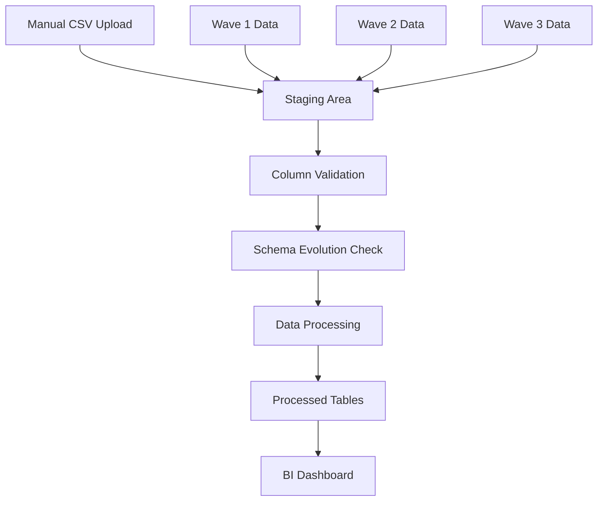

# Spark No. 9 - Multi-Schema Data Pipeline Design Document

**Version:** 1.0  
**Date:** September 2025  
**Author:** DevDash Labs & Spark No. 9 Team

---

## 1. Architecture Overview

### **1.1 Core Design Principles**
- **Schema Isolation**: Each client-platform combination gets dedicated schema
- **Wave Flexibility**: Support multiple waves with varying column structures
- **Schema Evolution**: Handle column differences between waves automatically
- **Data Integrity**: Maintain data quality across wave variations

### **1.2 Schema Naming Convention**
```
Pattern: client_{client_name}_{platform}_{year}
Examples:
- client_caterpillar_meta_2024
- client_nike_linkedin_2024
- client_startup_meta_2024
```

### **1.3 High-Level Data Flow**


---

## 2. Client Onboarding Flow

### **2.1 Onboarding Process Steps**

#### **Step 1: Initial Client Setup**
```sql
-- Execute client-platform schema creation
CALL create_client_platform_schema('caterpillar', 'meta', '2024');
```

#### **Step 2: Schema Structure Creation**
Each schema contains standardized tables with schema evolution support:

```sql
-- Core tables created per client schema
CREATE SCHEMA client_caterpillar_meta_2024;

-- 1. Raw data staging with flexible structure
CREATE TABLE raw_data_staging (
    wave_number INT,
    wave_name STRING,
    upload_timestamp TIMESTAMP DEFAULT CURRENT_TIMESTAMP(),
    file_name STRING,
    raw_data VARIANT,  -- JSON for flexible column handling
    processed_flag BOOLEAN DEFAULT FALSE,
    schema_version STRING
);

-- 2. Column mapping table for schema evolution
CREATE TABLE wave_schema_mapping (
    wave_number INT,
    column_name STRING,
    column_type STRING,
    is_required BOOLEAN,
    default_value STRING,
    mapping_rule STRING  -- How to handle missing columns
);

-- 3. Standardized processed data
CREATE TABLE processed_campaign_data (
    wave_number INT,
    wave_name STRING,
    -- Core fields (always present)
    ad_set_name STRING,
    campaign_id STRING,
    -- Standard metrics (with nulls for missing data)
    impressions INT,
    clicks INT,
    amount_spent FLOAT,
    -- Wave-specific data as JSON
    additional_metrics VARIANT,
    processed_timestamp TIMESTAMP DEFAULT CURRENT_TIMESTAMP()
);
```

#### **Step 3: Access Control Setup**
```sql
-- Create role and permissions
CREATE ROLE client_caterpillar_meta_2024_role;
GRANT USAGE ON SCHEMA client_caterpillar_meta_2024 TO ROLE client_caterpillar_meta_2024_role;
GRANT ALL ON ALL TABLES IN SCHEMA client_caterpillar_meta_2024 TO ROLE client_caterpillar_meta_2024_role;

-- Grant to users
GRANT ROLE client_caterpillar_meta_2024_role TO USER sean@sparkno9.com;
GRANT ROLE client_caterpillar_meta_2024_role TO USER allison@sparkno9.com;
```

### **2.2 Complete Onboarding Procedure**---

https://claude.ai/public/artifacts/f624bd75-c8d8-457a-9e4c-574d89bcd794

## 3. Wave Management & Schema Evolution

### **3.1 Wave Data Upload Process**

#### **Upload Workflow for Each Wave:**

https://claude.ai/public/artifacts/4d81b253-b0b9-4d50-8175-1640b688f7ff

### **3.2 Column Variation Handling Examples**

#### **Scenario 1: Wave 2 Has Additional Columns**
```sql
-- Wave 1 columns: ad_set_name, impressions, clicks, amount_spent
-- Wave 2 columns: ad_set_name, impressions, clicks, amount_spent, video_plays, video_completion_rate

-- System automatically handles additional columns in Wave 2
-- New columns stored in additional_metrics JSON field
-- Core processing continues seamlessly
```

#### **Scenario 2: Wave 3 Missing Some Columns**
```sql
-- Wave 1 columns: ad_set_name, impressions, clicks, amount_spent, reach
-- Wave 3 columns: ad_set_name, impressions, clicks, amount_spent (reach missing)

-- System uses default values or NULL for missing columns
-- Processing logs note missing columns for review
-- Data quality score adjusted accordingly
```

---

## 4. Data Quality & Validation---

https://claude.ai/public/artifacts/1b144adc-170f-4d1e-9356-347badba29ca

## 5. Complete Usage Examples---

https://claude.ai/public/artifacts/a840af3c-429f-41f6-a4e8-c747e6cc5804

## 6. Implementation Checklist & Best Practices

### **6.1 Pre-Implementation Setup**
- [ ] **Snowflake Environment Setup**
  - [ ] Create `spark_no9_main` database
  - [ ] Setup compute warehouse with auto-suspend
  - [ ] Configure resource monitors for cost control
  - [ ] Create administrative roles

- [ ] **Client Schema Templates**
  - [ ] Test schema creation procedure
  - [ ] Validate table structures
  - [ ] Test upload procedures with sample data

- [ ] **Access Control**
  - [ ] Create base roles for Spark team
  - [ ] Test role inheritance and permissions
  - [ ] Document role assignment procedures

### **6.2 Go-Live Process**
1. **Pilot Client Selection**: Start with Caterpillar Meta campaign
2. **Historical Data Migration**: Upload 1-2 completed waves for validation
3. **CoLab Output Comparison**: Validate results match existing processes
4. **Team Training**: SQL basics and upload procedures
5. **Production Deployment**: Process new wave data live

### **6.3 Monitoring & Maintenance**

#### **Daily Monitoring**
```sql
-- Check processing status
SELECT schema_name, wave_number, processing_stage, status, processing_timestamp
FROM (
  SELECT 'client_caterpillar_meta_2024' as schema_name, * FROM client_caterpillar_meta_2024.processing_log
  UNION ALL
  SELECT 'client_nike_linkedin_2024' as schema_name, * FROM client_nike_linkedin_2024.processing_log
  -- Add other clients as needed
)
WHERE processing_timestamp >= CURRENT_DATE()
ORDER BY processing_timestamp DESC;
```

#### **Weekly Quality Reports**
```sql
-- Generate quality summary across all clients
WITH client_quality AS (
  SELECT 
    REGEXP_REPLACE(table_schema, '^client_([^_]+)_.*', '\\1') as client,
    AVG(data_quality_score) as avg_quality,
    COUNT(*) as total_records,
    MAX(processed_timestamp) as last_processed
  FROM information_schema.tables t
  JOIN client_caterpillar_meta_2024.processed_campaign_data d 
    ON t.table_schema LIKE 'client_%'
  GROUP BY client
)
SELECT * FROM client_quality ORDER BY avg_quality DESC;
```

### **6.4 Best Practices**

#### **Schema Management**
- Use consistent naming: `client_{name}_{platform}_{year}`
- Archive completed projects annually
- Monitor schema count and storage usage
- Regular cleanup of temporary staging data

#### **Data Quality**
- Validate each wave after processing
- Monitor for column variations between waves
- Set up alerts for data quality scores < 0.8
- Document any manual data corrections

#### **Performance Optimization**
- Use appropriate warehouse sizes for processing
- Enable result caching for BI queries
- Monitor credit usage by client
- Optimize frequent queries with views

#### **Security & Compliance**
- Regular role and permission audits
- Client data isolation verification
- Data retention policy enforcement
- Backup and recovery procedures

---

## 7. Troubleshooting Guide

### **7.1 Common Issues**

#### **Upload Failures**
```sql
-- Check failed uploads
SELECT * FROM client_caterpillar_meta_2024.processing_log 
WHERE status = 'ERROR' AND processing_stage LIKE '%UPLOAD%'
ORDER BY processing_timestamp DESC;
```

#### **Column Mapping Issues**
```sql
-- Review schema evolution for problematic waves
SELECT wave_number, column_name, column_type, mapping_rule
FROM client_caterpillar_meta_2024.wave_schema_mapping
WHERE wave_number = [PROBLEM_WAVE];
```

#### **Processing Errors**
```sql
-- Identify processing bottlenecks
SELECT processing_stage, COUNT(*) as error_count, MAX(processing_timestamp) as last_error
FROM client_caterpillar_meta_2024.processing_log
WHERE status = 'ERROR'
GROUP BY processing_stage
ORDER BY error_count DESC;
```

### **7.2 Recovery Procedures**

#### **Reprocess Failed Wave**
```sql
-- Reset processing flag and reprocess
UPDATE client_caterpillar_meta_2024.raw_data_staging 
SET processed_flag = FALSE 
WHERE wave_number = [WAVE_NUMBER];

CALL process_wave_data('client_caterpillar_meta_2024', [WAVE_NUMBER]);
```

#### **Schema Correction**
```sql
-- Update column mapping for future processing
UPDATE client_caterpillar_meta_2024.wave_schema_mapping 
SET mapping_rule = 'use_default_value', default_value = '0'
WHERE wave_number = [WAVE_NUMBER] AND column_name = '[COLUMN_NAME]';
```

---

## 8. Success Metrics & KPIs

### **8.1 Technical Metrics**
- **Data Quality Score**: >95% across all waves
- **Processing Time**: <5 minutes per wave
- **Upload Success Rate**: >99%
- **Schema Evolution Events**: Tracked and resolved

### **8.2 Business Metrics**
- **Manual Processing Time Reduction**: Target 80% reduction
- **Error Rate Decrease**: Target 90% reduction in data errors
- **Client Onboarding Speed**: <30 minutes new client setup
- **Team Efficiency**: More time for analysis vs. data processing

### **8.3 Monitoring Queries**
```sql
-- Weekly success metrics
SELECT 
  COUNT(DISTINCT schema_name) as active_clients,
  AVG(data_quality_score) as avg_quality,
  COUNT(*) as total_processed_records,
  COUNT(CASE WHEN status = 'ERROR' THEN 1 END) / COUNT(*) * 100 as error_rate_pct
FROM (
  -- Union all client processing logs
  SELECT 'client_caterpillar_meta_2024' as schema_name, data_quality_score, status 
  FROM client_caterpillar_meta_2024.processed_campaign_data p
  JOIN client_caterpillar_meta_2024.processing_log l ON p.wave_number = l.wave_number
  -- Add other clients
)
WHERE processed_timestamp >= CURRENT_DATE() - 7;
```

---

**This design document provides a comprehensive foundation for implementing the multi-schema, multi-wave data pipeline with robust column variation handling. The system is designed to grow with Spark No. 9's client base while maintaining data quality and operational efficiency.**