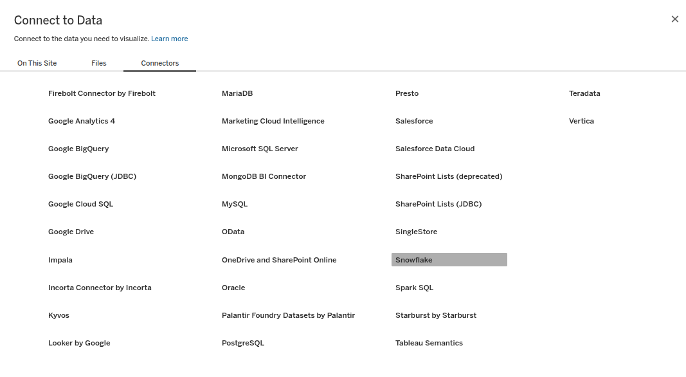
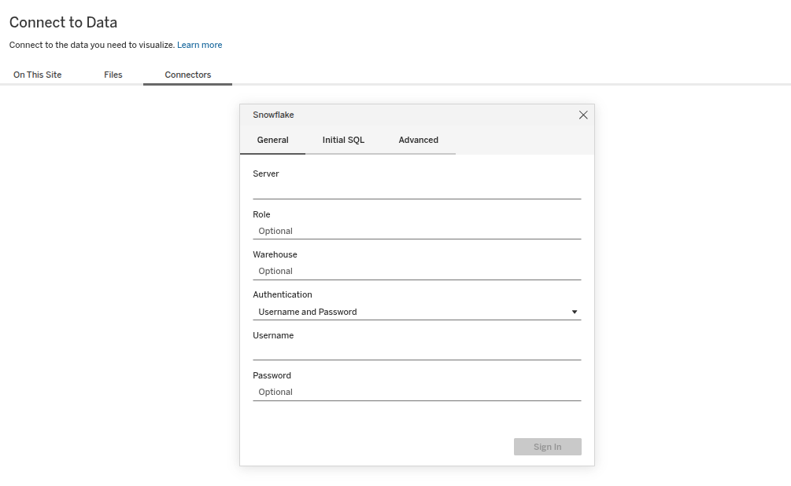
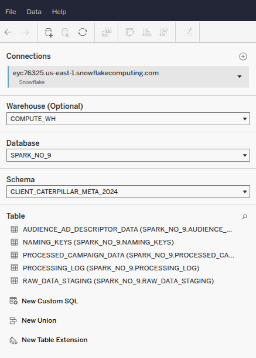
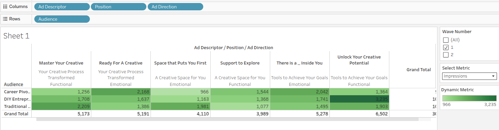
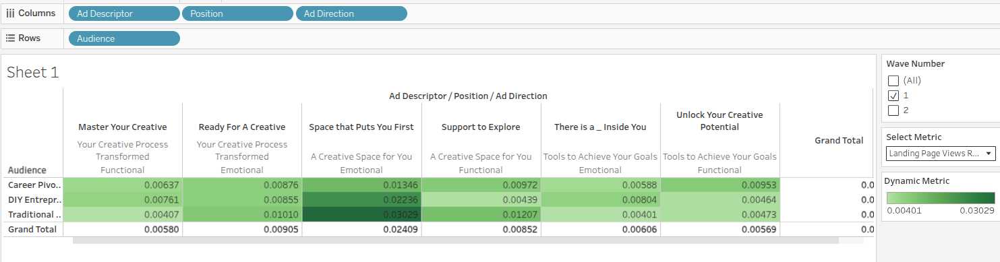
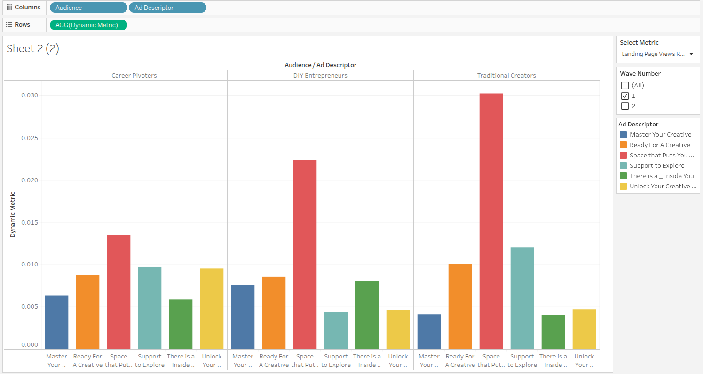
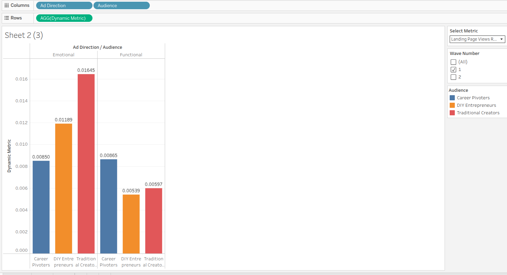
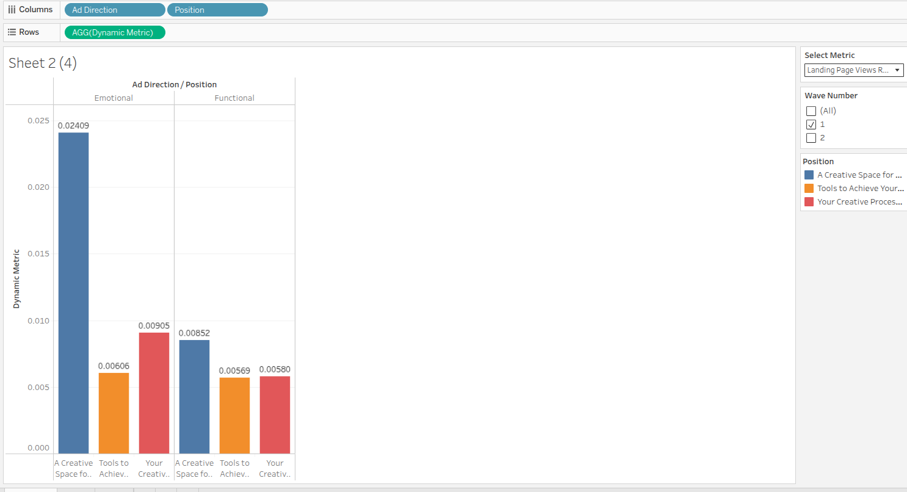
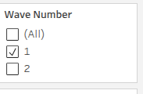

# Tableau Chart Creation Guide

## Overview

This guide provides step-by-step instructions for creating charts and visualizations in Tableau, from connecting to Snowflake to building various chart types including heatmaps and bar charts. This replaces the previous Google Colab-based workflow with a more efficient and interactive approach.

## Table of Contents

1. [Connecting to Snowflake](#connecting-to-snowflake)
2. [Data Connection Types](#data-connection-types)
3. [Creating Heatmaps](#creating-heatmaps)
4. [Creating Bar Charts](#creating-bar-charts)
5. [Using Dynamic Metrics](#using-dynamic-metrics)
6. [Applying Filters](#applying-filters)

---

## 1. Connecting to Snowflake

### Step 1: Access Connectors

When you open Tableau, you'll see the connector panel on the left side. Scroll through the available connectors to find **Snowflake**.



### Step 2: Enter Snowflake Credentials

After selecting Snowflake, you'll be prompted to enter your connection details. Tableau supports two authentication methods:

#### Option A: Username/Password Authentication

**Note:** This method only works when MFA (Multi-Factor Authentication) is NOT enabled on your Snowflake account. If MFA is enabled, you must use Key Pair Authentication (Option B).

- **Server**: Your Snowflake account URL (e.g., `xy12345.us-east-1.snowflakecomputing.com`)
- **Username**: Your Snowflake username
- **Password**: Your Snowflake password
- **Warehouse**: The warehouse you want to use
- **Database**: The database containing your data
- **Schema**: The schema within your database



#### Option B: Key Pair Authentication (Required when MFA is Enabled)

For enhanced security, you can use RSA key pair authentication instead of passwords. This is the recommended approach for production environments.

**Prerequisites:**
- An RSA private key file (PEM format)
- The corresponding public key must be assigned to your Snowflake user account

**Connection Details:**
- **Server**: Your Snowflake account URL (e.g., `xy12345.us-east-1.snowflakecomputing.com`)
- **Authentication**: Select **Key Pair** from the authentication dropdown
- **Username**: Your Snowflake username
- **Private Key File**: Browse and select your RSA private key file (.pem)
- **Private Key Passphrase**: Enter the passphrase if your private key is encrypted (optional)
- **Warehouse**: The warehouse you want to use
- **Database**: The database containing your data
- **Schema**: The schema within your database

**Setting Up Key Pair Authentication:**

1. **Generate RSA Key Pair** (if not already done):
   ```bash
   # Generate private key
   openssl genrsa 2048 | openssl pkcs8 -topk8 -inform PEM -out rsa_key.p8 -nocrypt

   # Generate public key
   openssl rsa -in rsa_key.p8 -pubout -out rsa_key.pub
   ```

2. **Assign Public Key to Snowflake User:**
   ```sql
   -- Remove header/footer and line breaks from public key first
   ALTER USER <username> SET RSA_PUBLIC_KEY='MIIBIjANBgkqhki...';
   ```

3. **Configure Tableau Desktop Connection:**
   - Select **Key Pair** as authentication method
   - Browse to your private key file (`rsa_key.p8`)
   - Enter passphrase if applicable
   - Complete other connection details

4. **Add Private Key to Tableau Account Settings (Required for Tableau Cloud/Server):**

   If you plan to publish workbooks to Tableau Cloud or Tableau Server, you must also save your key-pair credentials in your account settings:

   - Sign in to Tableau Cloud or Tableau Server
   - Navigate to **My Account Settings**
   - In the **Security** section, find **Saved Credentials for Data Sources**
   - Click **Add** next to Snowflake
   - In the popup window:
     - Select **Key-pair Authentication**
     - Enter your Snowflake server name
     - Enter your Username (case-sensitive)
     - Optionally enter a Role (case-sensitive)
     - Click **Browse** and upload your private key file (.p8)
     - If your key has a password, enter it in the Password field
   - Click **Add** to save the credentials

   **Important Notes:**
   - The credentials saved in Tableau Cloud/Server must exactly match the connection settings in your workbook
   - This is only required when publishing from Tableau Desktop or Prep Builder
   - Key-pair authentication in published workbooks is not supported for web authoring, tabcmd, or REST API
   - Requires ODBC driver version 3.4.0 or newer

**Benefits of Key Pair Authentication:**
- Enhanced security - no passwords stored in Tableau workbooks
- Better for automated refreshes and published data sources
- Supports passwordless authentication workflows
- Meets enterprise security compliance requirements
- Required when MFA is enabled on Snowflake accounts

### Step 3: Verify Connection

Once connected, you'll see your Snowflake connection listed in the **Connections** panel. You can now access tables and views from your Snowflake database.



### Step 4: Select Your Data View

For this project, we're working with the platform-specific `AUDIENCE_AD_DESCRIPTOR_DATA` views. Each platform has its own view (e.g., `META_AUDIENCE_AD_DESCRIPTOR_DATA`, `LINKEDIN_AUDIENCE_AD_DESCRIPTOR_DATA`) within the client schema. These views combine campaign data with naming keys to provide a comprehensive dataset for analysis.

**The view structure (example for Meta platform):**

```sql
CREATE OR REPLACE VIEW CLIENT_CATERPILLAR_2024.META_AUDIENCE_AD_DESCRIPTOR_DATA AS
SELECT
    -- All columns from campaign data
    d.*,
    
    -- All columns from naming keys (except ad_set_name to avoid duplication)
    nk.audience,
    nk.ad_descriptor,
    nk.landing_page,
    nk.position,
    nk.concept,
    nk.ad_direction
    
FROM CLIENT_CATERPILLAR_2024.META_PROCESSED_CAMPAIGN_DATA d
JOIN CLIENT_CATERPILLAR_2024.META_NAMING_KEYS nk
    ON d.ad_set_name = nk.ad_set_name;
```

**View Design:**
- Uses `d.*` to include all columns from the campaign data table automatically
- Explicitly adds naming key dimensions (audience, ad_descriptor, etc.)
- Excludes `ad_set_name` from naming keys to avoid duplication (already in campaign data)
- Single comprehensive view suitable for all use cases: analysis, reporting, and dashboards

**Key Fields in the View:**

**Dimensions (from naming keys):**
- `WAVE_NUMBER` - Campaign wave identifier
- `AUDIENCE` - Target audience segment
- `AD_DESCRIPTOR` - Ad description/creative identifier
- `LANDING_PAGE` - Landing page URL or identifier
- `POSITION` - Ad position/placement
- `CONCEPT` - Creative concept
- `AD_DIRECTION` - Ad creative direction

**Core Performance Metrics:**
- `AMOUNT_SPENT_USD` - Total spend in USD
- `RESULTS` - Campaign results/conversions
- `COST_PER_RESULT` - Cost per result (CPA)
- `IMPRESSIONS` - Total impressions
- `REACH` - Unique users reached
- `UNIQUE_LINK_CLICKS` - Unique clicks on links
- `LANDING_PAGE_VIEWS` - Number of landing page views

**Social Engagement Metrics:**
- `POST_COMMENTS` - Number of comments on posts
- `POST_REACTIONS` - Number of reactions (likes, love, etc.)
- `POST_SAVES` - Number of times posts were saved
- `POST_SHARES` - Number of times posts were shared
- `FOLLOWS_OR_LIKES` - Total post engagements/page follows

**E-commerce Metrics:**
- `PURCHASES` - Total purchase conversions
- `IN_APP_PURCHASES` - Purchases made within the app
- `WEBSITE_PURCHASES` - Purchases made on the website
- `OFFLINE_PURCHASES` - Offline purchase conversions
- `META_PURCHASES` - Meta-attributed purchases

**Registration & Lead Metrics:**
- `REGISTRATIONS_COMPLETED` - Total completed registrations
- `IN_APP_REGISTRATIONS` - Registrations completed in-app
- `WEBSITE_REGISTRATIONS` - Registrations completed on website
- `OFFLINE_REGISTRATIONS` - Offline registration conversions

**Metadata:**
- `REPORTING_STARTS` - Campaign start date
- `REPORTING_ENDS` - Campaign end date
- `AD_SET_NAME` - Platform ad set name (Facebook/Meta, LinkedIn, etc.)
- `AD_SET_DELIVERY` - Delivery status
- `AD_NAME` - Individual ad name
- `CAMPAIGN_NAME` - Campaign name

After connecting to Snowflake, navigate to this view and drag it to the canvas to begin working with your data.

---

## 2. Data Connection Types

Tableau offers two primary connection modes when working with Snowflake:

### Live Connection

- Queries run directly against Snowflake in real-time
- Always displays the most current data
- Performance depends on Snowflake warehouse speed
- Recommended for smaller datasets or when real-time data is critical

### Extract

- Creates a local snapshot of your data
- Faster performance for large datasets
- Data must be refreshed manually or on a schedule
- Recommended for large datasets or when working offline


---

## 3. Creating Heatmaps

Heatmaps are excellent for visualizing metrics across two dimensions with color intensity representing the metric value.

### Example 1: Impressions Heatmap

This heatmap shows impressions across different dimensions:



**Steps to create:**

1. Drag your first dimension to **Columns** (e.g., Time period)
2. Drag your second dimension to **Rows** (e.g., Category or segment)
3. Drag your metric (e.g., Impressions) to **Color** on the Marks card
4. Select **Square** as the mark type
5. Adjust the color scheme to make patterns more visible
6. Add labels if needed by dragging the metric to **Label**

### Example 2: Landing Page Views Rate Heatmap

This heatmap displays the landing page views rate metric:



**Best practices:**

- Use diverging color schemes for metrics where the middle value is meaningful
- Use sequential color schemes (like blue or green gradients) for metrics where higher is better
- Ensure your color legend is visible and clearly labeled
- Consider adding borders between cells for better readability

### Using Dynamic Metrics with Heatmaps

Instead of creating separate heatmaps for each metric, you can use a **dynamic metric selector** to switch between different metrics using the same heatmap template.

**How it works:**

1. Create a parameter called "Select Metric" with all available metrics (see [Dynamic Metrics section](#5-using-dynamic-metrics) for detailed setup)
2. Create the "Dynamic Metric" calculated field with the CASE statement
3. Build your heatmap template once:
   - Drag your first dimension to **Columns** (e.g., Wave Number)
   - Drag your second dimension to **Rows** (e.g., Audience or Position)
   - Drag the **Dynamic Metric** calculated field to **Color**
   - Select **Square** as the mark type
4. Show the parameter control (right-click parameter → **Show Parameter**)

**Result:** Users can now switch between any metric (Impressions, Reach, Cost Per Click, Landing Page Views Rate, etc.) using a single heatmap template. This approach:

- Saves time by eliminating the need to create multiple heatmaps
- Provides a consistent visualization experience
- Allows users to explore different metrics interactively
- Reduces dashboard maintenance


---

## 4. Creating Bar Charts

Bar charts are ideal for comparing values across categories.

### Pivot Audience Ad Description Chart

This chart shows metrics pivoted by audience and ad description:



**Steps to create:**

1. Drag your categorical dimension to **Rows** or **Columns**
2. Drag your metric to the opposite shelf (Columns or Rows)
3. For grouped bars, drag a secondary dimension to **Color**
4. Sort bars by clicking the sort icon in the toolbar
5. Add data labels by dragging the metric to **Label**

### Pivot Audience Ad Director Chart

This chart displays metrics by audience and ad director:



### Pivot Position Ad Director Chart

This chart shows metrics by position and ad director:



**Tips for effective bar charts:**

- Keep labels concise and readable
- Use color strategically to highlight important categories
- Sort bars by value to make comparisons easier
- Consider horizontal bars for long category names

---

## 5. Using Dynamic Metrics

Dynamic metrics allow users to switch between different measures in a single visualization, making dashboards more interactive and flexible.

### Creating a Dynamic Metric Parameter


**Steps to create:**

1. **Create a Parameter:**
   - Right-click in the Data pane and select **Create Parameter**
   - Name it "Select Metric" or similar
   - Set Data Type to **String**
   - Set Allowable Values to **List**
   - Add your metric names (e.g., "Impressions", "Clicks", "CTR", "Conversions")

2. **Create a Calculated Field:**

   Name the calculated field "Dynamic Metric" and use the following formula:

   ```
   CASE [Select Metric]
       WHEN "Amount Spent" THEN SUM([Amount Spent Usd])
       WHEN "Results" THEN SUM([Results])
       WHEN "Impressions" THEN SUM([Impressions])
       WHEN "Reach" THEN SUM([Reach])
       WHEN "Landing Page Views" THEN SUM([Landing Page Views])
       WHEN "Unique Link Clicks" THEN SUM([Unique Link Clicks])
       WHEN "Cost Per Result" THEN AVG([Cost Per Results])
       WHEN "Landing Page Views Rate" THEN SUM([Landing Page Views]) / SUM([Impressions])
       WHEN "Cost Per Landing Page View" THEN SUM([Amount Spent Usd]) / SUM([Landing Page Views])
       WHEN "Click-Through Rate" THEN SUM([Unique Link Clicks]) / SUM([Impressions])
       WHEN "Cost Per Click" THEN SUM([Amount Spent Usd]) / SUM([Unique Link Clicks])
       WHEN "Engagement Rate" THEN (SUM([POST_COMMENTS]) + SUM([POST_REACTIONS]) + SUM([POST_SAVES]) + SUM([POST_SHARES]) + SUM([FOLLOWS_OR_LIKES])) / SUM([Impressions])
       WHEN "Purchase Rate" THEN SUM([PURCHASES]) / SUM([Impressions])
       WHEN "Cost Per Purchase" THEN SUM([Amount Spent Usd]) / SUM([PURCHASES])
   END
   ```

   **Available Metrics:**
   - **Amount Spent**: Total campaign spend
   - **Results**: Total campaign results/conversions
   - **Impressions**: Total ad impressions
   - **Reach**: Unique users reached
   - **Landing Page Views**: Total landing page views
   - **Unique Link Clicks**: Total unique clicks
   - **Cost Per Result**: Average cost per result (uses AVG aggregation)
   - **Landing Page Views Rate**: Percentage of impressions that led to landing page views
   - **Cost Per Landing Page View**: Cost efficiency for landing page views
   - **Click-Through Rate**: Percentage of impressions that resulted in clicks
   - **Cost Per Click**: Cost efficiency for clicks
   - **Engagement Rate**: Social engagement (comments, reactions, saves, shares, follows) per impression
   - **Purchase Rate**: Purchase conversions per impression
   - **Cost Per Purchase**: Cost efficiency for purchases

3. **Use the Calculated Field:**
   - Drag the calculated field to your visualization
   - Show the parameter control by right-clicking the parameter and selecting **Show Parameter**
   - Users can now select which metric to display

**Benefits:**

- Reduces dashboard clutter
- Allows users to explore different metrics without creating multiple sheets
- Provides a cleaner, more professional presentation

---

## 6. Applying Filters

Filters help focus your analysis on specific subsets of data.

### Wave Filter Example



**Types of Filters:**

1. **Dimension Filters:**
   - Drag a dimension to the Filters shelf
   - Select which values to include or exclude
   - Right-click and select **Show Filter** to make it visible on the dashboard

2. **Measure Filters:**
   - Drag a measure to the Filters shelf
   - Set minimum, maximum, or range values
   - Useful for focusing on top performers or outliers

3. **Date Filters:**
   - Drag a date field to the Filters shelf
   - Choose from relative dates (Last N days, months, etc.) or absolute ranges
   - Essential for time-series analysis

**Filter Best Practices:**

- Apply filters at the data source level when possible for better performance
- Use context filters for large datasets to improve query efficiency
- Make relevant filters visible to dashboard users for self-service analysis
- Use "Apply to Worksheets" to control which sheets are affected by each filter

---

## Common Workflow: From Connection to Chart

Here's a typical workflow for creating analysis in Tableau:

1. **Connect to Snowflake** using the credentials and connection details
2. **Select your connection type** (Live or Extract - recommend Extract)
3. **Choose your tables/views** and create any necessary joins or unions
4. **Create calculated fields** if you need custom metrics or dimensions
5. **Build your visualization**:
   - Drag dimensions and measures to shelves
   - Select appropriate mark type
   - Apply formatting and colors
6. **Add filters** to focus your analysis
7. **Create parameters** for dynamic metrics if needed
8. **Build a dashboard** by combining multiple sheets
9. **Add interactivity** with filters and actions
10. **Publish or share** your analysis

---

