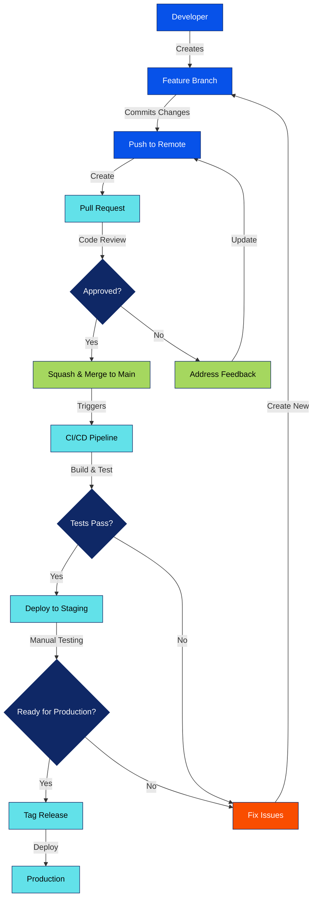

## **Standard Operating Procedure (SOP) for Version Control**

I'll create an improved version of the Version Control SOP as a Markdown file with the streamlined structure we discussed.

 <artifact identifier="modern-version-control-sop" title="Modern Version Control SOP" type="text/markdown"> # Version Control - Quick Reference Guide 

This guide provides practical version control practices for our team. It's designed to help you quickly find what you need and implement best practices with minimal friction.


:::success
First time with Git? **Learn interactively** - [Version Control & GitHub Guide](/doc/version-control-github-guide-InHiAriDug#h-learn-interactively-here) 

:::

## Quick Reference

| Task | Command/Pattern | Example |
|----|----|----|
| Create feature branch | `git checkout -b feature/<issue>-<description>` | `git checkout -b feature/101-user-auth` |
| Create release branch | `git checkout -b release/v<version>` | `git checkout -b release/v1.2.0` |
| Commit changes | `<type>: <description>` | `feat: add login form validation` |
| Push branch | `git push -u origin <branch-name>` | `git push -u origin feature/101-user-auth` |
| Update from main | `git pull origin main` |    |
| Squash and merge PR | GitHub UI: "Squash and merge" button |    |

## Core Workflow




## 1. Branching Strategy

We use a simplified branching model with three primary branch types:

`main → feature/* → main  (Main pattern) `

`main → release/* → main  (For scheduled releases) `

`main → hotfix/* → main   (For emergency fixes) `

### Branch Naming

* **Feature branches**: `feature/<issue-number>-<short-description>`
  * Example: `feature/101-user-authentication`
* **Release branches**: `release/v<major>.<minor>.<patch>`
  * Example: `release/v1.0.0`
* **Hotfix branches**: `hotfix/<issue-number>-<description>`
  * Example: `hotfix/102-fix-login-bug`

### When to create each branch type

* **Feature branch**: For any new feature or non-emergency bugfix
* **Release branch**: When preparing a scheduled release (assemble multiple features)
* **Hotfix branch**: For urgent fixes needed in production

## 2. Commit Standards

### Commit Message Format

We follow the [Conventional Commits](https://www.conventionalcommits.org/) specification:

`<type>: <description>  [optional body]  [optional footer(s)] `

### Types

* `feat`: New feature
* `fix`: Bug fix
* `docs`: Documentation change
* `style`: Formatting, missing semicolons, etc.
* `refactor`: Code change that neither fixes a bug nor adds a feature
* `test`: Adding/updating tests
* `chore`: Updating build tasks, package manager configs, etc.

### Tips for good commits

* Commit early and often
* Each commit should represent a single logical change
* Write clear, descriptive messages in the imperative mood
* Link to issues where appropriate with `#issue-number`

## 3. Pull Request Workflow

### Creating a PR


1. Push your branch to GitHub
2. Create a PR via GitHub UI
3. Fill in the PR template
4. Request reviews from appropriate team members

### PR Template

```markdown
## Description
[Brief description of changes]

## Related Issue
Fixes #[issue number]

## Type of change
- [ ] Bug fix
- [ ] New feature
- [ ] Breaking change
- [ ] Documentation update

## Testing
- [ ] Tests have been added/updated
- [ ] All tests pass locally

## Screenshots (if applicable)
```


### Code Review Guidelines

* Review PRs within 24 hours when possible
* Provide constructive feedback
* Approve only when all requirements are met
* Use GitHub's review features (comments, suggestions, approvals)
* Small PRs are easier to review - aim for focused changes

## 4. Release Process

### Preparing a Release


1. Create a release branch: `release/v1.2.0`
2. Bump version numbers in relevant files
3. Update CHANGELOG.md
4. Create a PR to merge back into main
5. Once approved and merged, tag the release

### Creating a Version Tag

```bash
git checkout main 
git pull 
git tag -a v1.2.0 -m "Release v1.2.0" 
git push origin v1.2.0 
```

### Release Notes

Include in your release notes:

* New features
* Bug fixes
* Breaking changes and migration instructions
* Contributors
* Links to key PRs or issues

## Additional Guidelines

### Handling Large Files

* Don't commit large binary files directly to Git
* Use Git LFS for binary assets when necessary
* Consider external storage for very large files

### Security Best Practices

* Never commit secrets (API keys, passwords, tokens)
* Use environment variables or secret management tools
* Regularly review repository access permissions
* Enable required PR reviews for protected branches

### Helpful Git Commands

```bash
# See recent branches you've worked on
git for-each-ref --sort=-committerdate refs/heads/ --format='%(committerdate:short) %(refname:short)'

# Stash changes temporarily
git stash save "work in progress"
git stash pop

# Clean up local branches
git fetch -p && git branch -vv | grep ': gone]' | awk '{print $1}' | xargs git branch -d

# Interactive rebase to clean up commits before PR
git rebase -i HEAD~3  # Rebase last 3 commits
```

## Troubleshooting Common Issues

### "My PR has merge conflicts"

```bash
git checkout your-branch 
git fetch origin 
git merge origin/main 

# Resolve conflicts in your editor 

git add . 
git commit -m "resolve merge conflicts" 
git push 
```


### "I committed to the wrong branch"

```bash
# Save your changes
git log -n 1 --pretty=format:%H  # Copy the commit hash
git checkout correct-branch
git cherry-pick <commit-hash>
# Go back and remove from wrong branch if needed
git checkout wrong-branch
git reset --hard HEAD~1
```

### "I need to update my PR after feedback"

```bash
# Make your changes
git add .
git commit -m "address PR feedback"
git push
```


## Resources

* [GitHub Docs](https://docs.github.com/en)
* [Conventional Commits](https://www.conventionalcommits.org/)
* [Git Cheat Sheet](https://education.github.com/git-cheat-sheet-education.pdf) 

## Learn interactively here: 

[https://learngitbranching.js.org](https://learngitbranching.js.org)

## 
