# Spark No. 9 - Campaign Data Processor User Guide

**Version 1.0** | Last Updated: October 2024

---

## Table of Contents

1. [Introduction](#introduction)
2. [Getting Started with Snowflake](#getting-started-with-snowflake)
3. [Setting Up Secure Authentication](#setting-up-secure-authentication)
4. [Accessing the Data Processing App](#accessing-the-data-processing-app)
5. [Using the Campaign Data Processor](#using-the-campaign-data-processor)
6. [Viewing Your Processed Data](#viewing-your-processed-data)
7. [Troubleshooting](#troubleshooting)

---

## Introduction

Welcome to the Spark No. 9 Campaign Data Processor! This tool helps you upload and organize your advertising campaign data into a structured database where you can easily analyze and report on your campaign performance.

### What This Tool Does

- **Organizes Your Data**: Takes your campaign CSV files and structures them in a database
- **Validates Information**: Checks your data for errors and missing information
- **Prepares Data**: Automatically creates views for analysis and reporting
- **Tracks History**: Keeps a log of all your data uploads

### What You'll Need

- ✅ Snowflake account login credentials
- ✅ Two CSV files for each upload:
  - **Campaign Data File**: Contains your campaign performance metrics (impressions, clicks, spend, etc.)
  - **Naming Key File**: Contains your campaign naming conventions and organization
- ✅ Basic information about your upload:
  - Client code
  - Platform (Meta, LinkedIn, etc.)
  - Year
  - Wave number

---

## Getting Started with Snowflake

### What is Snowflake?

Snowflake is a cloud-based data platform where your campaign data is stored and processed. Think of it as a highly secure filing cabinet in the cloud that can handle massive amounts of data.
When your account administrator invites you to join Snowflake, you’ll receive an email invitation to activate your account. Here’s how to get started:

### Step 0: Activate Your Snowflake Account

1. **Find the Invitation Email**

   You’ll get an email from your Snowflake account administrator (look for the sender "Snowflake Computing" or your company’s data team). Open the email and click the invitation/activation link.

2. **Set Your Password**

   After clicking the activation link, you’ll be prompted to set up your password. Choose a secure password following the requirements displayed.

3. **Set Up Multi-Factor Authentication (MFA)**

   **For Paid Snowflake Accounts (MFA is required):**  
   Immediately after setting your password, you’ll be asked to enable MFA for security.
   
   - A page will appear with a QR code.
   - **On your phone:** Download an authenticator app if you don’t already have one. Supported apps include **Google Authenticator**, **Microsoft Authenticator**, **Duo Mobile**, and others (from the App Store or Google Play).
   - Open your authenticator app and add a new account (usually with a "+" or "Scan QR code" option).
   - Scan the QR code displayed in your browser.
   - The app will generate a 6-digit code—type this code into the Snowflake signup prompt to complete registration.
   - This will register your device as your MFA method.

   **For Free (Trial) Snowflake Accounts (MFA is optional):**  
   After activating your account and logging in, you can enable MFA to better protect your account.
   
   - Click your user icon in the top right, go to **Settings > Authentication**.
   - Look for the option to enable Multi-Factor Authentication or similar wording.
   - Follow the prompts: as above, use **Google Authenticator**, **Microsoft Authenticator**, **Duo Mobile**, or any app you prefer.
   - Scan the provided QR code, then enter the 6-digit code from your authenticator app to register your device.

> **Tip:** Any authentication app that supports TOTP (Time-based One-Time Passwords) will work, including Google Authenticator, Microsoft Authenticator, Duo Mobile, Authy, and others.

4. **Finish Login**

   Use your username and password to sign in. If you enabled MFA, you’ll be prompted each time to enter a code from your authentication app.

You’re now ready to access Snowflake and start using the Campaign Data Processor!


### Step 1: Access Your Snowflake Account

1. **Get Your Login URL**
   
   Your Snowflake login URL will look like one of these formats:
   ```
   https://<account_identifier>.snowflakecomputing.com
   ```
   
   Example: `https://igc36816.us-east-1.snowflakecomputing.com`
   
   > **Note**: Your administrator will provide your specific login URL. **Bookmark this page for easy access!**

2. **Navigate to the Login Page**
   
   Open your web browser (Chrome, Firefox, Safari, or Edge) and go to your Snowflake login URL.


### Step 2: Login with Your Credentials

1. **Enter Your Username**
   
   Your username is typically your email address or a username provided by your administrator.
   
   Example: `john.smith@sparkno9.com` or `jsmith`

2. **Enter Your Password**
   
   Enter the password provided by your administrator. You'll be prompted to change it on your first login.

3. **Click "Sign In"**


### Step 3: Welcome to Snowflake!

Once logged in, you'll see the Snowflake interface. This is your home base for working with data.

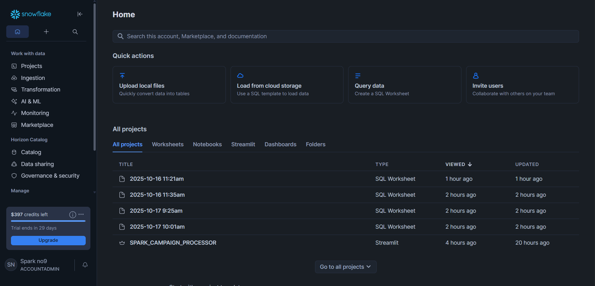

For this demo, focus on two main menu items on the left side: **Projects** and **Catalog**.

- **Projects**: Access and manage your project workspaces.
- **Catalog**: Browse and explore available datasets.

See the screenshot below to familiarize yourself with where these options are located in the navigation menu:

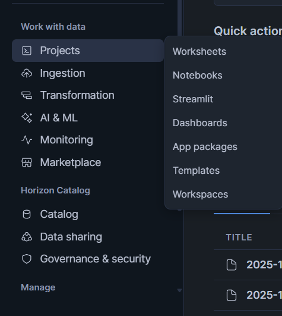

Here is a closer look at the Catalog menu location:

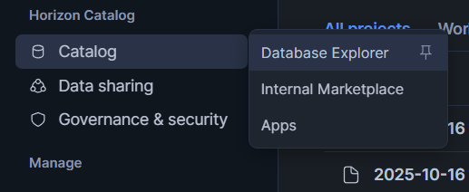

You will also notice that inside "Projects," you can find **Streamlit** and **Worksheets**, which are important components for our project. We have covered how to use these features in the sections below—refer to those for step-by-step guidance.


---

## Setting Up Secure Authentication

This step is important because it sets up a secure connection between Tableau and Snowflake using key-pair authentication. Without it, you won’t be able to connect Tableau to paid Snowflake account.

> **Note**: Paid Snowflake accounts require this setup. If you’re using Tableau with a free trial Snowflake account, it may be optional, but it is still strongly recommended for better security. If you aren’t sure which account type you have, check with your administrator.

### What is Key-Pair Authentication?

Instead of using a password, you create two special files called "keys":
- **Private Key**: Like a super-secure password that stays on your computer (never share this!)
- **Public Key**: A matching key that you give to Snowflake (safe to share)

Think of it like a special lock and key system: Snowflake has the lock (public key), and only your key (private key) can open it.

### Step 1: Generate Your Key Pair

You'll need to use a command-line tool to generate keys. Don't worry—just follow these steps carefully:

#### For Windows Users:

1. **Check if OpenSSL is Installed**

   OpenSSL is required for generating keys. If you don't already have it installed, the following steps will not work. 

   - To check if OpenSSL is installed, open Command Prompt or PowerShell and type:
     ```bash
     openssl version
     ```
   - If you get an error or "command not found," you need to install OpenSSL. You can download it for Windows from [https://slproweb.com/products/Win32OpenSSL.html](https://slproweb.com/products/Win32OpenSSL.html).

   - **After installation, add the OpenSSL `bin` folder (usually `C:\Program Files\OpenSSL-Win64\bin` or similar) to your Windows "Path" environment variable:**
     - Search for "Edit the system environment variables" in the Start Menu.
     - Click "Environment Variables..."
     - Under "System variables," select "Path" and click "Edit."
     - Click "New" and enter the path to the OpenSSL `bin` directory.
     - Click "OK" to save your changes.
     - Restart any open Command Prompt or PowerShell windows for changes to take effect.

2. **Open Command Prompt or PowerShell**
   - Press `Windows Key + R`
   - Type `cmd` and press Enter

3. **Navigate to a Safe Location**
   ```bash
   cd %USERPROFILE%\Documents
   mkdir snowflake_keys
   cd snowflake_keys
   ```

4. **Generate the Private Key**
   ```bash
   openssl genrsa 2048 | openssl pkcs8 -topk8 -inform PEM -out rsa_key.p8 -nocrypt
   ```
   
5. **Generate the Public Key**
   ```bash
   openssl rsa -in rsa_key.p8 -pubout -out rsa_key.pub
   ```

#### For Mac/Linux Users:

1. **Open Terminal**
   - Press `Command + Space`, type "Terminal", and press Enter
   
2. **Navigate to a Safe Location**
   ```bash
   cd ~/Documents
   mkdir snowflake_keys
   cd snowflake_keys
   ```

3. **Generate the Private Key**
   ```bash
   openssl genrsa 2048 | openssl pkcs8 -topk8 -inform PEM -out rsa_key.p8 -nocrypt
   ```
   
4. **Generate the Public Key**
   ```bash
   openssl rsa -in rsa_key.p8 -pubout -out rsa_key.pub
   ```

**[SCREENSHOT PLACEHOLDER: Terminal/Command Prompt showing key generation commands]**

> ⚠️ **Important**: The `rsa_key.p8` file is your private key. Never share this file with anyone or upload it anywhere!

### Step 2: Add Your Public Key to Snowflake

Now you need to tell Snowflake about your public key:

1. **View Your Public Key**
   
   Open the `rsa_key.pub` file with a text editor (Notepad, TextEdit, etc.). It will look something like this:
   
   ```
   -----BEGIN PUBLIC KEY-----
   MIIBIjANBgkqhkiG9w0BAQEFAAOCAQ8AMIIBCgKCAQEAy...
   [many more lines of random characters]
   ...
   -----END PUBLIC KEY-----
   ```

2. **Copy the Key Contents (Without Headers)**
   
   Copy everything EXCEPT the `-----BEGIN PUBLIC KEY-----` and `-----END PUBLIC KEY-----` lines.
   
   You should copy only the middle part (the random-looking characters).

3. **Open Snowflake Worksheets**
   
   - Log in to Snowflake
   - Click "Projects" in the left menu
   - Click "Worksheets"
   - Click the "+ Worksheet" button to create a new worksheet
   
   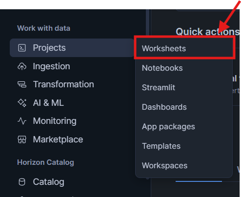

4. **Run the ALTER USER Command**
   
   In the worksheet, type this command (replace the placeholders):
   
   ```sql
   ALTER USER <your_username> 
   SET RSA_PUBLIC_KEY='<paste_your_public_key_here>';
   ```
   
   **Example**:
   ```sql
   ALTER USER john 
   SET RSA_PUBLIC_KEY='MIIBIjANBgk....';
   ```
   
   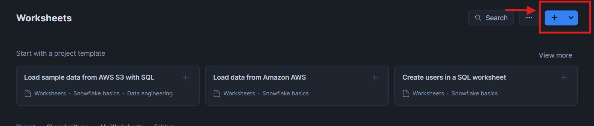


5. **Execute the Command**
   
   - Click the "Run" button (or press `Ctrl+Enter` on Windows, `Cmd+Enter` on Mac)
   - You should see a success message: "Statement executed successfully"
   
   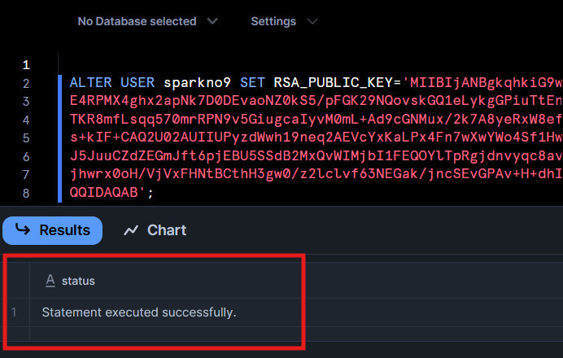

6. **Verify the Key Was Added**
   
   Run this command to verify:
   
   ```sql
   DESC USER <your_username>;
   ```
   
   Look for the `RSA_PUBLIC_KEY_FP` property—it should show a fingerprint value, confirming your key is registered.

**🎉 Congratulations!** Your secure authentication is now set up.

---

## Accessing the Data Processing App

The Campaign Data Processor is a Streamlit application that runs inside Snowflake. Here's how to find and open it:

### Step 1: Navigate to Streamlit Apps

1. **Click "Streamlit" in the Left Menu**
   
   In the Snowflake Snowsight interface, click on "Streamlit" inside projects in the left navigation menu.
   
    

2. **Find "SPARK_CAMPAIGN_PROCESSOR"**
   
   You'll see a list of available Streamlit apps. Look for the app named:
   ```
   SPARK_CAMPAIGN_PROCESSOR
   ```
   or similar (your administrator will confirm the exact name).
   
   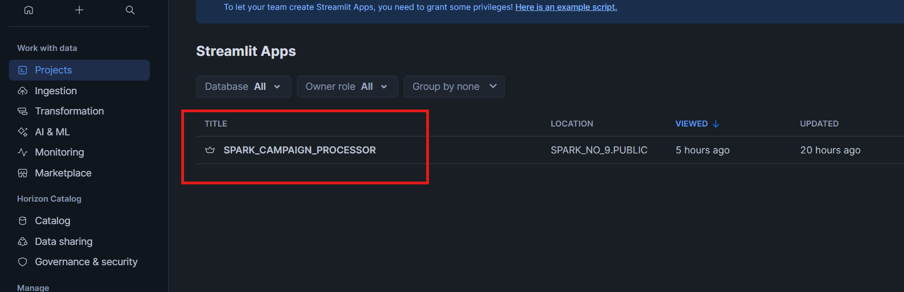

3. **Click to Open the App**
   
   Click on the app name to launch it. The app will open in a new view.

### Step 2: Familiarize Yourself with the Interface

Once the app loads, you'll see a clean, simple interface with several sections:

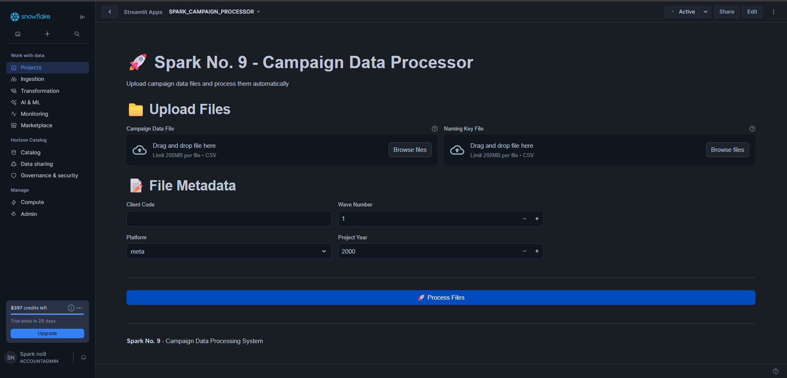

The app is organized into clear sections:
- **Upload Files**: Where you upload your CSV files
- **File Metadata**: Where you enter information about your data
- **Process Files Button**: Starts the processing

---

## Using the Campaign Data Processor

Now for the main event—uploading and processing your campaign data!

### Before You Begin: Prepare Your Files

Make sure you have two CSV files ready:

#### 1. Campaign Data File

This file contains your campaign performance metrics. It should include columns like:
- Campaign Name
- Ad Name
- Ad Set Name
- Impressions
- Clicks
- Amount Spent
- Results
- And any other performance metrics


#### 2. Naming Key File

This file contains your campaign naming conventions and organization. It should include columns like:
- Ad Set Name (this is the key that links to your campaign data)
- Audience
- Concept
- Position
- Ad Descriptor
- Ad Direction
- Landing Page


> 💡 **Tip**: The `Ad Set Name` or `Ad Name` column must exist in BOTH files—this is how the system links them together!

### Step 1: Upload Your Files


1. **Upload Campaign Data File**
   
   - Click the "Browse files" button under "Campaign Data File"
   - Navigate to your campaign data CSV file
   - Select the file and click "Open"
   - You'll see the filename appear, confirming the upload

2. **Upload Naming Key File**
   
   - Click the "Browse files" button under "Naming Key File"
   - Navigate to your naming key CSV file
   - Select the file and click "Open"
   - You'll see the filename appear, confirming the upload

    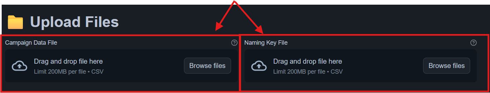

> 📝 **Note**: Files must be in CSV format and under 50MB. The upload fields are not interchangeable—you must upload the campaign data file in the left column and the naming key file in the right column.

### Step 2: Enter File Metadata

This is where you provide information about the data you're uploading. Each field is important for organizing your data correctly.

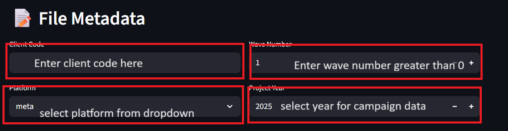

#### Field 1: Client Code

**What it is**: A short identifier for your client/brand.

**Examples**: 
- `NS1`
- `OO1`
- `DD`
- `ST2`

**Guidelines**:
- Use symbols
- Keep it short and memorable
- Be consistent—use the same code every time for the same client

**Why it matters**: This determines which database schema your data goes into. All data for the same client and year will be stored together.

#### Field 2: Platform

**What it is**: Which advertising platform this data came from.

**Available options**:
- `meta` (for Facebook/Instagram campaigns)
- `linkedin` (for LinkedIn campaigns)
- `facebook` (For facebook only analysis)
- `instagram` (for instagram only analysis)

**Guidelines**:
- Choose from the dropdown menu


**Why it matters**: Your data tables will be prefixed with the platform name (e.g., META_PROCESSED_CAMPAIGN_DATA, LINKEDIN_NAMING_KEYS), making it easy to work with data from multiple platforms.

#### Field 3: Wave Number

**What it is**: A sequential number representing the campaign wave, batch, or upload sequence.

**Examples**: 
- `1` (for your first wave)
- `2` (for your second wave)
- `3` (and so on...)

**Guidelines**:
- Start with 1 for your first campaign wave
- Maximum value: 100
- Minimum value: 1

**Why it matters**: This helps you track different campaign waves and updates. You can upload data for wave 2 without affecting wave 1 data.

#### Field 4: Project Year

**What it is**: The year associated with this campaign data.

**Examples**: 
- `2024`
- `2025`

**Guidelines**:
- Use the 4-digit year format
- Typically matches the year the campaign ran
- Can be any year between 2000 and 2090
- Default value is current year

**Why it matters**: This helps organize data by year and is part of your database schema name (e.g., CLIENT_CATERPILLAR_2024).

### Step 3: Process Your Files


Once you've uploaded both files and filled in all metadata fields:

1. **Review Your Information**
   
   Double-check that:
   - ✅ Both files are uploaded in the correct input fields
   - ✅ Client code is correct
   - ✅ Platform is selected
   - ✅ Wave number is correct
   - ✅ Year is correct

2. **Click "🚀 Process Files"**
   
   The big blue button at the bottom will start the processing.

### Step 4: Monitor the Processing Steps

The app will walk through several steps automatically. You'll see real-time status updates:


**Screenshots:**

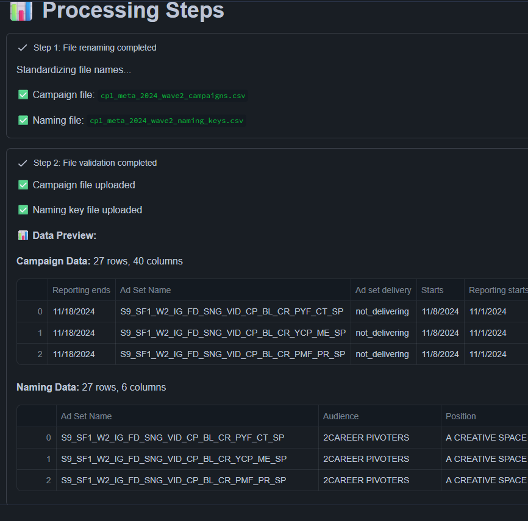
<br>
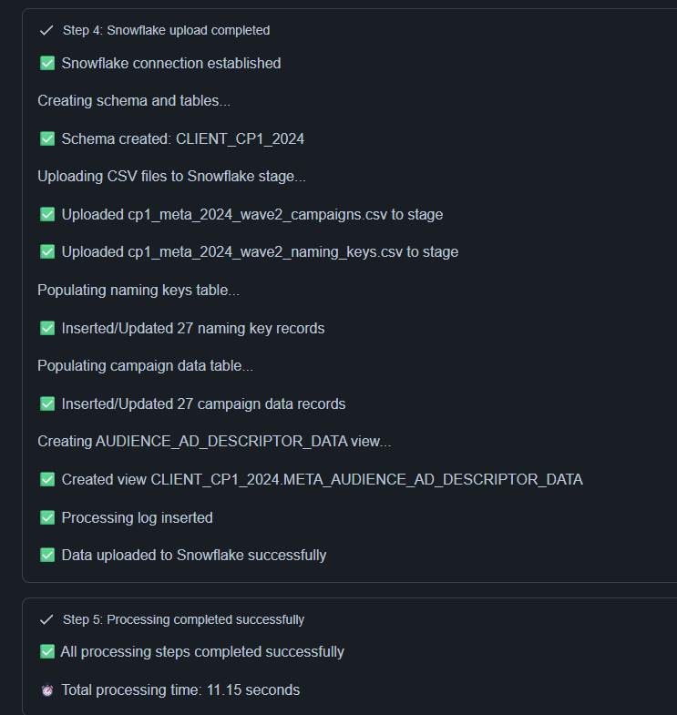
<br>
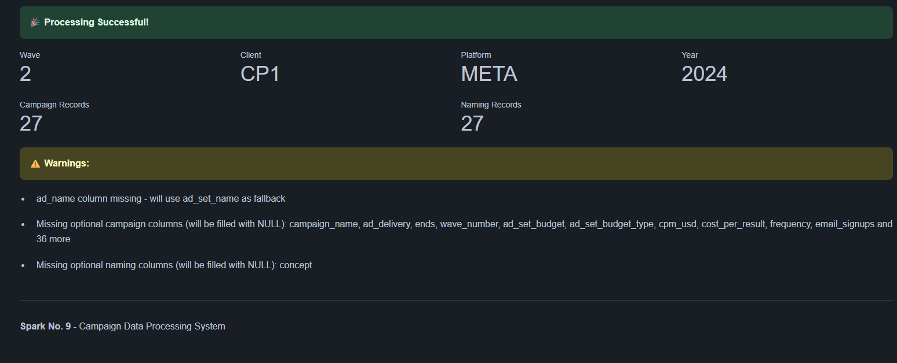


#### Step 1: Renaming Files

The app standardizes your filenames for consistency.

**What you'll see**:
```
✅ Campaign file: caterpillar_meta_2024_wave1_campaigns.csv
✅ Naming file: caterpillar_meta_2024_wave1_naming_keys.csv
```

#### Step 2: Validating Files

The app checks your files for errors and shows you a preview of your data.

**What you'll see**:
- Row and column counts
- First few rows of data
- Any warnings about missing columns

**Example**:
```
✅ Campaign file uploaded
✅ Naming key file uploaded

📊 Data Preview:
Campaign Data: 1,245 rows, 45 columns
[Preview of first 3 rows]

Naming Data: 156 rows, 7 columns
[Preview of first 3 rows]
```


#### Step 3: Processing Data

The app validates, cleans, and prepares your data.

**What you'll see**:
```
✅ Data validation completed
✅ Processed 1,245 campaign records
✅ Processed 156 naming records
```

**Possible warnings**:
- Missing optional columns (these will be filled with NULL—that's okay!)
- Data type conversions
- Duplicate records removed

#### Step 4: Uploading to Snowflake

The app creates your database schema (if needed) and uploads the data.

**What you'll see**:
```
✅ Snowflake connection established
Creating schema and tables...
✅ Schema created: CLIENT_CATERPILLAR_2024
Uploading CSV files to Snowflake stage...
✅ Uploaded caterpillar_meta_2024_wave1_campaigns.csv to stage
✅ Uploaded caterpillar_meta_2024_wave1_naming_keys.csv to stage
Populating naming keys table...
✅ Inserted/Updated 156 naming key records
Populating campaign data table...
✅ Inserted/Updated 1,245 campaign data records
Creating AUDIENCE_AD_DESCRIPTOR_DATA view...
✅ Created view CLIENT_CATERPILLAR_2024.META_AUDIENCE_AD_DESCRIPTOR_DATA
✅ Processing log inserted
```


#### Step 5: Finalizing

Final processing steps and summary.

**What you'll see**:
```
✅ All processing steps completed successfully
⏱️ Total processing time: 12.45 seconds
```

### Step 5: Review the Results

After successful processing, you'll see:

**🎉 Processing Successful!**

**Summary Metrics**:
- **Wave**: 1
- **Client**: CATERPILLAR
- **Platform**: META
- **Year**: 2024
- **Campaign Records**: 1,245
- **Naming Records**: 156

**Warnings** (if any):
- List of any non-critical warnings (e.g., missing optional columns)

### What If Something Goes Wrong?

If processing fails, you'll see:

**❌ Processing Failed!**

**Error Details**: [Specific error messages]

**Common issues and solutions**:

1. **"Missing critical columns: ad_set_name"**
   - Solution: Make sure your CSV has a column named "ad_set_name" (or "Ad Set Name")

2. **"Campaign data file is empty"**
   - Solution: Check that your CSV file has data (not just headers)

3. **"Failed to establish Snowflake connection"**
   - Solution: Contact your administrator—this is a system configuration issue

4. **"No matching columns between uploaded data and table schema"**
   - Solution: Verify your CSV files have the expected column names

> 💡 **Tip**: If you see errors, don't panic! You can fix your CSV files and try again. No data is lost.

---

## Viewing Your Processed Data

Once your data is processed, it's stored in Snowflake. Here's how to explore and query it.

### Understanding Your Data Structure

Your data is organized in a hierarchical structure:

```
DATABASE (e.g., SPARK_NO_9_TEST)
└── SCHEMA (e.g., CLIENT_CATERPILLAR_2024)
    ├── Tables
    │   ├── META_NAMING_KEYS
    │   ├── META_PROCESSED_CAMPAIGN_DATA
    │   ├── LINKEDIN_NAMING_KEYS (if you've uploaded LinkedIn data)
    │   ├── LINKEDIN_PROCESSED_CAMPAIGN_DATA (if you've uploaded LinkedIn data)
    │   └── PROCESSING_LOG (shared across all platforms)
    ├── Views
    │   ├── META_AUDIENCE_AD_DESCRIPTOR_DATA
    │   └── LINKEDIN_AUDIENCE_AD_DESCRIPTOR_DATA (if applicable)
    └── Stage
        └── CLIENT_CATERPILLAR_2024_STAGE
```

**Key Concepts**:

- **Database**: The top-level container (set by your administrator)
- **Schema**: Organized by client and year (e.g., CLIENT_CATERPILLAR_2024)
- **Tables**: Where your raw data is stored
  - **Platform-prefixed naming tables** (e.g., META_NAMING_KEYS): Your campaign naming conventions
  - **Platform-prefixed campaign tables** (e.g., META_PROCESSED_CAMPAIGN_DATA): Your campaign performance metrics
  - **PROCESSING_LOG**: History of all your uploads (shared across platforms)
- **Views**: Pre-joined data combining naming and campaign data for easy analysis
- **Stage**: Temporary storage for uploaded CSV files (for backup/audit purposes)

### Step 1: Navigate to the Catalog

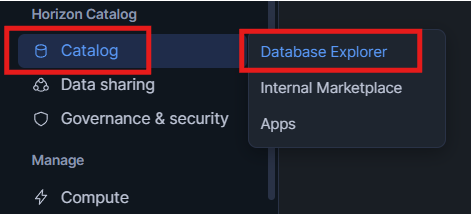


1. **Click "Catalog" in the Left Menu**
   
   In Snowflake, click on "Catalog" in the left navigation menu.

2. **Click "Database Explorer"**
   
   You'll see a list of databases you have access to.

3. **Find Your Database**
   
   Look for the database name (e.g., `SPARK_NO_9` or similar—your administrator will confirm).
   
   Click on it to expand.

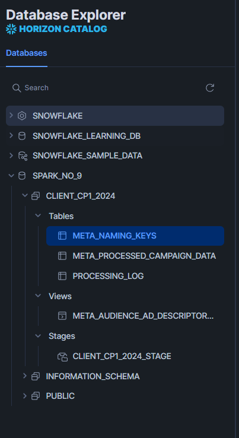


### Step 2: Find Your Schema


1. **Expand the Database**
   
   Click the arrow/triangle next to your database name to expand it.

2. **Look for Schemas**
   
   You'll see a list of schemas. Find yours based on the client name and year:
   
   Format: `CLIENT_{CLIENTNAME}_{YEAR}`
   
   Examples:
   - `CLIENT_CP1_2024`
   - `CLIENT_NK1_2024`
   - `CLIENT_PKL_2025`

3. **Click on Your Schema**
   
   Click on your schema name to expand it and see the tables and views inside.

### Step 3: Explore Your Tables

Click on "Tables" to see all tables in your schema:

#### META_NAMING_KEYS (or LINKEDIN_NAMING_KEYS, etc.)

**What it contains**: Your campaign naming conventions and organization.

**Columns**:
- `ad_set_name` (Primary Key)
- `audience`
- `concept`
- `position`
- `ad_descriptor`
- `ad_direction`
- `landing_page`
- `wave_number`
- `upload_timestamp`

**How to view**:
1. Click on `META_NAMING_KEYS`
2. Click the "Preview" button to see the first 100 rows
3. Or, click "Open in Worksheet" to query it with SQL

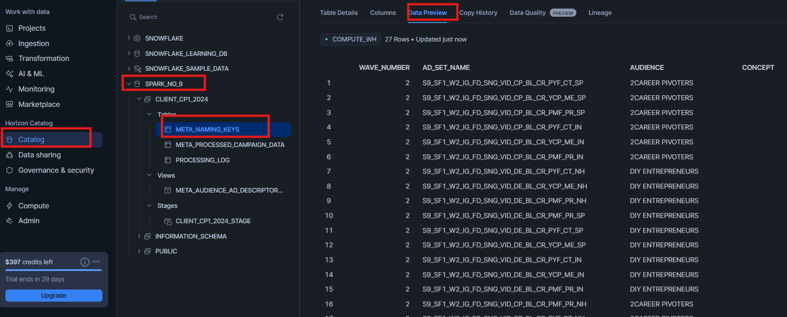


#### META_PROCESSED_CAMPAIGN_DATA (or LINKEDIN_PROCESSED_CAMPAIGN_DATA, etc.)

**What it contains**: Your campaign performance data and metrics.

**Columns** (sample—your data may have more):
- `ad_name` (Primary Key)
- `ad_set_name` (Links to naming keys)
- `campaign_name`
- `impressions`
- `results`
- `amount_spent_usd`
- `reach`
- `frequency`
- `cpm_usd`
- `kpv_community`, `kpv_tool`, etc. (key performance values)
- `lead_openhouse`, `lead_workshop`, etc. (lead generation metrics)
- `adds_to_cart`, `purchases`, etc. (e-commerce metrics)
- `wave_number`
- `upload_timestamp`

**How to view**:
1. Click on `META_PROCESSED_CAMPAIGN_DATA`
2. Click the "Preview" button to see the first 100 rows
3. Or, click "Open in Worksheet" to query it with SQL

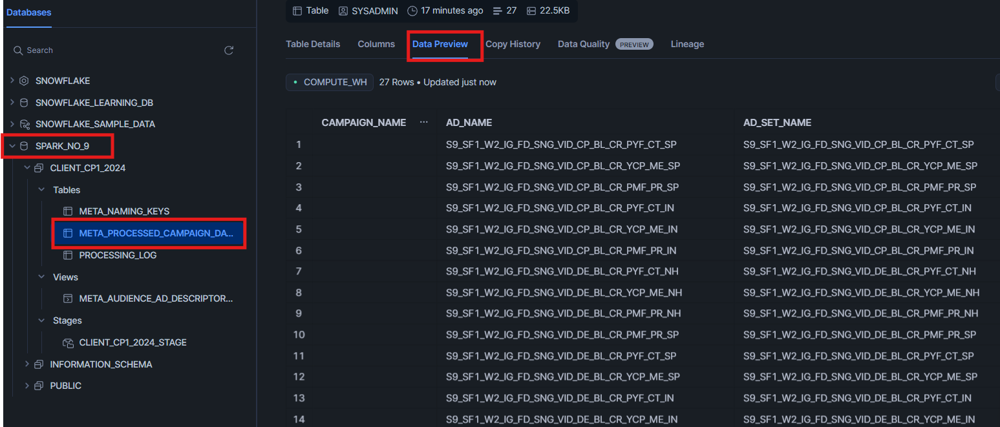


#### PROCESSING_LOG

**What it contains**: A history of all your data uploads and processing activities (shared across all platforms).

**Columns**:
- `log_id` (Auto-incrementing ID)
- `wave_number`
- `processing_timestamp`
- `status` (SUCCESS or FAILED)
- `records_processed`
- `errors_count`
- `warnings_count`
- `processing_time_seconds`
- `client_name`
- `platform`
- `year`

**How to view**:
1. Click on `PROCESSING_LOG`
2. Click the "Preview" button
3. See all your historical uploads and their status


### Step 4: Use the Pre-Built View for Analysis

The easiest way to analyze your data is through the pre-built view that combines your campaign data with your naming conventions.


1. **Click on "Views"**
   
   In your schema, click on "Views" to see available views.

2. **Find META_AUDIENCE_AD_DESCRIPTOR_DATA** (or LINKEDIN_AUDIENCE_AD_DESCRIPTOR_DATA)
   
   This view contains ALL columns from both your campaign data and naming keys, pre-joined for you.

3. **Preview or Query the View**
   
   Click "Preview" to see the data, or "Open in Worksheet" to write custom queries.

**What's in this view**:
- All campaign performance metrics
- All naming convention fields
- Everything joined by `ad_set_name`
- Ready for analysis and reporting

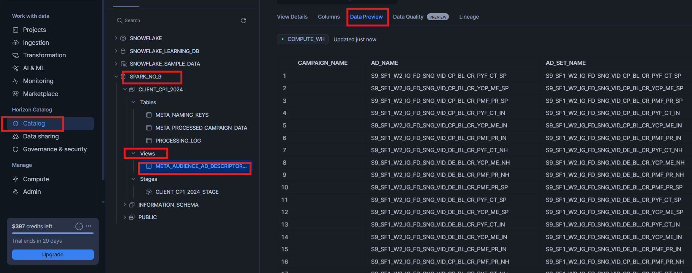


### Step 5: Query Your Data with SQL

For custom analysis, you can write SQL queries:

1. **Open a New Worksheet**
   
   - Click "Projects" → "Worksheets"
   - Click "+ Worksheet"

2. **Select Your Database and Schema**
   
   At the top of the worksheet, select:
   - Database: Your database name
   - Schema: Your client schema (e.g., CLIENT_CATERPILLAR_2024)


    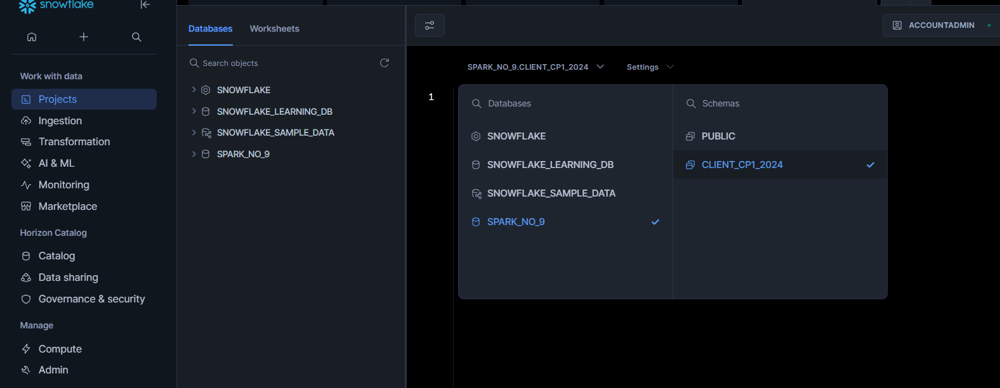

3. **Write a Query**
   
   **Example 1: View all Meta campaigns from Wave 1**
   ```sql
   SELECT *
   FROM META_AUDIENCE_AD_DESCRIPTOR_DATA
   WHERE wave_number = 1
   LIMIT 100;
   ```

   **Example 2: Calculate total spend by audience**
   ```sql
   SELECT 
       audience,
       SUM(amount_spent_usd) as total_spend,
       SUM(impressions) as total_impressions,
       SUM(results) as total_results
   FROM META_AUDIENCE_AD_DESCRIPTOR_DATA
   WHERE wave_number = 1
   GROUP BY audience
   ORDER BY total_spend DESC;
   ```

   **Example 3: View processing history**
   ```sql
   SELECT 
       processing_timestamp,
       wave_number,
       platform,
       status,
       records_processed,
       processing_time_seconds
   FROM PROCESSING_LOG
   ORDER BY processing_timestamp DESC;
   ```

4. **Run the Query**
   
   Click the "Run" button (or press Ctrl+Enter / Cmd+Enter).
   
   Results will appear below the query.


5. **Download Results**
   
   Click the download button to export results as CSV, Excel, or other formats.

---

## Troubleshooting

### Common Issues and Solutions

#### Issue: "I can't find the Streamlit app"

**Solutions**:
1. Make sure you're logged into Snowflake
2. Click "Streamlit" in the left menu
3. If you don't see the app, contact your administrator—you may need permissions
4. Refresh your browser (Ctrl+F5 / Cmd+Shift+R)

#### Issue: "File upload fails or times out"

**Solutions**:
1. Check your file size—must be under 50MB
2. Verify the file is in CSV format (not Excel .xlsx)
3. Make sure the file isn't corrupted—try opening it in Excel/Notepad first
4. Check your internet connection
5. Try uploading again

#### Issue: "Missing critical columns error"

**Solutions**:
1. Open your CSV in Excel or a text editor
2. Verify you have a column called "ad_set_name" (or "Ad Set Name")
3. For campaign data, verify you have "ad_name" or "ad_set_name"
4. Column names can have spaces and different capitalization—the app normalizes them
5. Make sure your CSV has headers (column names in the first row)

#### Issue: "Snowflake connection failed"

**Solutions**:
1. Check if you're still logged into Snowflake (session may have expired)
2. Log out and log back in
3. Contact your administrator—this may be a permissions or configuration issue

#### Issue: "I uploaded the wrong file by mistake"

**Solution**:
Don't worry! The app uses "UPSERT" logic (update or insert):
- If you upload data with the same wave number, it will UPDATE existing records
- Simply upload the correct file with the same metadata (client, platform, year, wave)
- The new data will replace the old data for that wave

#### Issue: "I can't see my data in the database"

**Solutions**:
1. Make sure processing completed successfully (you saw the green success message)
2. Double-check you're looking in the correct schema:
   - Schema name format: CLIENT_{CLIENTNAME}_{YEAR}
   - Example: CLIENT_CATERPILLAR_2024
3. Verify the platform prefix on tables:
   - Meta data: META_NAMING_KEYS, META_PROCESSED_CAMPAIGN_DATA
   - LinkedIn data: LINKEDIN_NAMING_KEYS, LINKEDIN_PROCESSED_CAMPAIGN_DATA
4. Refresh the database view (click the refresh icon)
5. Check the PROCESSING_LOG table to see if your upload was recorded


---

