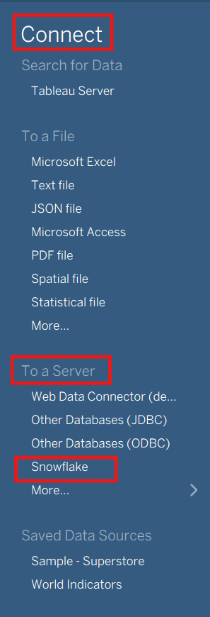
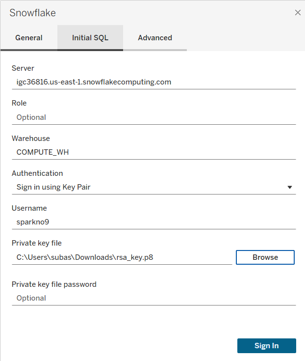
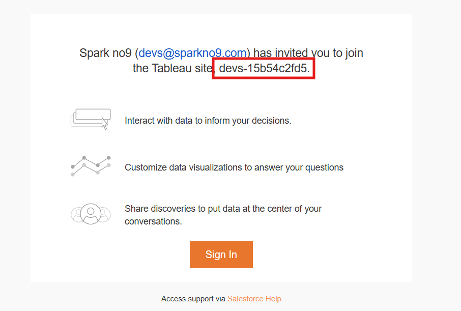

# Tableau User Guide for sparkno9

Welcome to the Tableau User Guide! This guide is designed for users who are new to Business Intelligence (BI) tools and will walk you through the essential steps to create meaningful visualizations and reports in Tableau.

## Table of Contents
1. [Getting Started](#getting-started)
2. [Creating a New Connection](#creating-a-new-connection)
3. [Creating a New Workbook](#creating-a-new-workbook)
4. [Dynamic Metrics and Filters](#dynamic-metrics-and-filters)
5. [Best Practices](#best-practices)

---

## Getting Started

Tableau is a powerful data visualization tool that helps you turn raw data into meaningful insights through interactive dashboards and reports. Before diving into creating visualizations, you'll need to:

1. **Launch Tableau Desktop** - Open the Tableau application on your computer
2. **Understand the Interface** - The main areas include:
   - **Data Source Page**: Where you connect to and prepare your data
   - **Worksheet**: Where you build individual visualizations
   - **Dashboard**: Where you combine multiple visualizations
   - **Story**: Where you create narrative presentations

---

## Creating a New Connection to Snowflake

A connection is how Tableau accesses your Snowflake data warehouse. Follow these steps to establish a secure and successful connection.

### Prerequisites

Before connecting, make sure you have:
- **Snowflake Username** – e.g., `john.doe@sparkno9.com` or `jdoe`
  - This is your Snowflake account identifier, provided by your administrator.
- **Warehouse Name** – e.g., `COMPUTE_WH` (default for most organizations)
  - This is the compute resource used to run queries. Use `COMPUTE_WH` unless your admin gives you a different value.
- **Role (optional)** – Determines data access. Leave blank to use your default.
- **Authentication Credentials**
  - **Key-pair Authentication** is required (see setup below).
- **Snowflake ODBC Driver** – Version 3.4.0 or newer (required for key-pair authentication).
- **Private Key File** – `.p8` or `.pem` file, provided by your administrator and stored securely on your computer.
  - **Never share your private key file.**

#### Key-Pair Authentication Setup

sparkno9 uses **Key-Pair Authentication** for Snowflake connections. This replaces passwords with cryptographic key pairs for high security.

**What is Key-Pair Authentication?**
- **Private Key**: Stays on your computer; never shared.
- **Public Key**: Registered with your Snowflake user account.
- Tableau uses your private key to authenticate, ensuring no password is sent over the network.

**For Administrators: Setting Up Key-Pair Authentication**

**Step 1: Generate a Key Pair**

Use OpenSSL (3.x or newer):

- **Generate the Private Key** (PKCS8, unencrypted):
  ```bash
  openssl genrsa 2048 | openssl pkcs8 -topk8 -inform PEM -out rsa_key.p8 -nocrypt
  ```
- **Generate the Public Key**:
  ```bash
  openssl rsa -in rsa_key.p8 -pubout -out rsa_key.pub
  ```

**Step 2: Assign the Public Key to the Snowflake User**

View the public key:
- On Mac/Linux, run:
  ```bash
  cat rsa_key.pub
  ```
- On Windows:
  - Open `rsa_key.pub` in Notepad or another text editor.

Copy the part that is *between* (but not including) `-----BEGIN PUBLIC KEY-----` and `-----END PUBLIC KEY-----`.
- Combine into one line, with no spaces or line breaks.

Assign the key to the user in Snowflake:
```sql
ALTER USER john_doe SET RSA_PUBLIC_KEY='MIIBIjANBgkq...';
```
Replace `john_doe` with the actual username, and paste the full public key string (no headers or line breaks).

**Step 3: Verify the Key Assignment**

Run:
```sql
DESC USER john_doe;
```
Look for the `RSA_PUBLIC_KEY` property—this should display the registered key. 

**Required Permissions:**
- You need the `SECURITYADMIN` role or higher.

**Security Tips:**
- Secure private keys safely—never share them.
- If a user leaves, revoke access by running:
  ```sql
  ALTER USER former_user UNSET RSA_PUBLIC_KEY;
  ```

**Why Key-Pair Authentication?**

- No passwords transmitted over networks
- Provides higher security (cryptographic credentials)
- Required for MFA-enabled accounts where password auth is blocked
- Better for automation and compliance (no password expiry)
- Enables seamless refreshes and embedded data connections

---

### Step 1: Access the Snowflake Connector

1. Open Tableau Desktop.
2. In the **Connect** pane (left sidebar), under **To a Server**, click **Snowflake**.


3. The connection dialog appears with tabs: **General**, **Authentication**, and **Initial SQL**.


---

### Step 2: Configure General Settings

In the **General** tab, enter the following:

1. **Server**: Your Snowflake account name.
   - Format: `account_name.region.cloud_provider`  
     e.g., `igc36816.us-east-1.snowflakecomputing.com`
   - Find this in your Snowflake account URL.

2. **Warehouse** (Optional): The compute warehouse (e.g., `COMPUTE_WH`)
   - This runs your queries. If unsure, use `COMPUTE_WH` or check with your admin.

3. **Role** (Optional): The Snowflake role for this session.
   - Leave blank for your default role.

---

### Step 3: Configure Key-Pair Authentication


**(Refer to the Prerequisites section above to ensure you have all required files and driver installed.)**

**Steps to Connect:**

1. In the Tableau connection dialog, under the **Authentication** dropdown, select **Sign in using Key Pair**.
2. Enter your **Username** (e.g., `john.doe@sparkno9.com` or `jdoe`).
3. Click **Browse** next to **Private Key File** and select your provided `.p8` or `.pem` private key.
4. Click **Sign In**. Tableau will authenticate via your key pair, and you will connect to Snowflake.

---

### Step 4: Verify Connection

After signing in, Tableau connects to Snowflake and displays the **Data Source** page:
- **Database**: Select from the dropdown
- **Schema**: Select from the dropdown
- **Tables**: All accessible tables and views are listed

The left pane lists all your available databases and schemas.

---

### Step 5: Select and Configure Tables

1. **Select a Database** from the dropdown.
2. **Select a Schema** from the list.
3. **Drag Tables to Canvas**:
   - Drag one or more tables to the main canvas to define your data source.
4. **Join Tables** (optional):
   - Drag more tables next to existing ones to create joins. Tableau auto-suggests join relationships.
   - Click the join icon to change join type (Inner, Left, Right, Full Outer).
5. **Choose Connection Type**:
   - **Live Connection**: Direct, real-time queries to Snowflake; always up-to-date, but may be slower and uses Snowflake credits.
   - **Extract**: Takes a snapshot of data into a local `.hyper` file; best for performance and offline use. Click **Extract** at the upper right to switch.
   
   
---


---

## Tableau Cloud Setup and User Management

This section covers how to set up Tableau Cloud accounts, invite users, publish workbooks, and access reports.

**Understanding Your Site ID and URL:**
- When you receive an invitation from Tableau Cloud, the email displays your **Site ID** (e.g., `devs-15b54c2fd5`)
- Click the **Sign In** button in the invitation email - this will take you directly to your Tableau Cloud site
- Your Tableau Cloud URL will typically look like: `https://prod-in-a.online.tableau.com/#/site/[your-site-id]/home`
- Example: Site ID `devs-15b54c2fd5` has the URL `https://prod-in-a.online.tableau.com/#/site/devs-15b54c2fd5/home`
- **Bookmark this URL** for easy access in the future

### Setting Up Your Tableau Cloud Account

Before you can publish workbooks or invite team members, you need access to Tableau Cloud.

**Initial Access:**
- Your organization administrator will send you an invitation email to join Tableau Cloud
- The email contains your site ID (e.g., `devs-15b54c2fd5`)
- Click the **Sign In** button in the email - this takes you directly to your Tableau Cloud site
- Your Tableau Cloud URL will be: `https://prod-in-a.online.tableau.com/#/site/[your-site-id]/home`
- **Bookmark this URL** for future logins
- Follow the instructions in the email to create your account and set your password
- Your **username will be your email address**

**Configuring Your Snowflake Credentials in Tableau Cloud:**

For published workbooks to connect to Snowflake, you must save your key-pair credentials in your account settings (see the [Key-Pair Authentication section](#additional-step-add-private-key-to-tableau-account-settings-for-publishing-workbooks) above for detailed instructions).

---

### Inviting Users to Tableau Cloud (For Administrators)

As an administrator, you can add team members like Sean or Allison to your Tableau Cloud site.

#### Step 1: Access User Management

1. Sign in to Tableau Cloud as an administrator
2. In the left navigation panel, click **Users**
3. On the Users page, click **Add Users**
4. Select **Add Users by Username**

#### Step 2: Enter User Information

1. **Enter email addresses** of users you want to invite (one per line):
   ```
   sean@sparkno9.com
   allison@sparkno9.com
   ```

2. **Select Authentication Method**:
   - Choose **Tableau with MFA** (recommended for password-based authentication)
   - Note: Key-pair authentication is configured by each user individually in their account settings

3. **Assign Site Role** - Choose based on what the user needs to do:
   - **Creator**: Full access - can connect to data, create and publish workbooks, edit content
   - **Explorer**: Can edit existing workbooks and create new content from published data sources
   - **Viewer**: Can view and interact with published dashboards only (read-only)

   For Sean and Allison, typically assign **Creator** or **Explorer** roles.

4. Click **Add Users**

#### Step 3: Send Invitations

- Tableau Cloud automatically sends invitation emails to the users
- The email contains a link to accept the invitation and set up their account

#### Alternative: Import Users via CSV

For adding multiple users at once:

1. Create a CSV file with columns: `Username, Site Role, Authentication Method`
   ```csv
   Username,Site Role,Authentication Method
   sean@sparkno9.com,Creator,Tableau with MFA
   allison@sparkno9.com,Explorer,Tableau with MFA
   ```

2. Click **Add Users** > **Import Users via CSV**
3. Upload your CSV file
4. Click **Import**

---

### Accepting an Invitation and Creating Your Account

When you receive an invitation email from Tableau Cloud:

#### Step 1: Accept the Invitation

1. Open the invitation email from Tableau Cloud (sent by your administrator)
2. **Note the Site ID** shown in the email - this identifies your Tableau site
   - The email will say something like: "has invited you to join the Tableau site, **devs-15b54c2fd5**"
   - Your Tableau Cloud URL will be: `https://prod-in-a.online.tableau.com/#/site/[your-site-id]/home`
   - Example: Site ID `devs-15b54c2fd5` becomes `https://prod-in-a.online.tableau.com/#/site/devs-15b54c2fd5/home`
   
   

3. Click the **Sign In** button in the email - this will take you directly to your Tableau Cloud site
4. You'll be directed to create your account
5. **Bookmark the URL** from your browser for easy access in the future

#### Step 2: Create Your Account

1. **Enter your information**:
   - Your **email address** will be pre-filled (this will be your username)
   - Create a **strong password** - this is where you set your own password
   - Complete any additional required fields

2. **Set up Multi-Factor Authentication (MFA)** if required:
   - Download an authenticator app (e.g., Google Authenticator, Microsoft Authenticator)
   - Scan the QR code provided
   - Enter the verification code

3. Click **Sign Up** or **Create Account**

**Important**: Your **username is your email address**. Use this email and the password you created to sign in to Tableau Cloud.

#### Step 3: Configure Snowflake Connection (For Publishing)

If you'll be publishing workbooks with Snowflake data:

1. Click on your profile icon (top right)
2. Select **My Account Settings**
3. Scroll to the **Security** section
4. Add your Snowflake key-pair credentials (see [Key-Pair Authentication section](#additional-step-add-private-key-to-tableau-account-settings-for-publishing-workbooks))

---

### Publishing Workbooks to Tableau Cloud

Once you've created a workbook in Tableau Desktop, you can publish it to Tableau Cloud for others to access.

#### Prerequisites

Before publishing, ensure:
- You have a **Creator** site role in Tableau Cloud
- You have **View** and **Save** permissions on the project you're publishing to
- Your Snowflake credentials are saved in Tableau Cloud (if your workbook uses Snowflake data)
- You're viewing a worksheet or dashboard tab (not the Data Source tab)

#### Step 1: Initiate Publishing

1. In Tableau Desktop, with your workbook open
2. Click **Server** in the top menu
3. Select **Publish Workbook** from the dropdown

**Shortcut**: Click the **Publish** button on the toolbar

#### Step 2: Sign In to Tableau Cloud

1. If prompted, enter your Tableau Cloud site URL
   - Format: `https://prod-in-a.online.tableau.com/#/site/[your-site-id]/home`
   - Example: `https://prod-in-a.online.tableau.com/#/site/devs-15b54c2fd5/home`
2. Enter your credentials:
   - **Username**: Your email address
   - **Password**: The password you created when accepting the invitation
3. Complete MFA verification if enabled
4. Click **Sign In**

#### Step 3: Configure Publishing Options

In the Publish Workbook dialog:

1. **Project**: Select the project where you want to publish
   - Default project is usually "Default"
   - Ask your administrator if you're unsure which project to use

2. **Name**: Enter or edit the workbook name
   - Use descriptive names (e.g., "Q4 Campaign Performance")

3. **Description** (Optional): Add a description to help others understand the workbook

4. **Tags** (Optional): Add tags for easier searching (e.g., "sales", "marketing", "Q4")

5. **Sheets**: Select which sheets to publish
   - **All Sheets**: Publishes all worksheets, dashboards, and stories
   - **Selected Sheets**: Choose specific sheets to publish
   - Hide sheets that are for internal calculations only

6. **Data Sources**:
   - **Embed password**: Select this to use your saved Snowflake credentials
     - Required for automatic data refreshes
     - Allows viewers to see data without authenticating
   - **Prompt user**: Users must enter their own credentials when viewing

7. **Show Sheets as Tabs**: Check to allow users to navigate between sheets

8. **Include External Files**: If your workbook uses external files, check this option

#### Step 4: Publish

1. Review your settings
2. Click **Publish**
3. Wait for the upload to complete
4. Once published, you'll see a success message with a link to view your workbook

#### Step 5: Verify Publication

1. Click **View it now** or navigate to Tableau Cloud in your browser
2. Find your workbook in the project you selected
3. Click on the workbook to open and verify it displays correctly
4. Test filters, parameters, and interactions

---

### Accessing Tableau Reports

There are two ways to access Tableau workbooks: through Tableau Cloud (web browser) or Tableau Desktop.

#### Accessing Reports in Tableau Cloud (Web Browser)

**Step 1: Sign In**

1. Open your web browser
2. Navigate to your Tableau Cloud site URL (the one you bookmarked earlier)
   - Format: `https://prod-in-a.online.tableau.com/#/site/[your-site-id]/home`
   - Example: `https://prod-in-a.online.tableau.com/#/site/devs-15b54c2fd5/home`
3. Enter your credentials:
   - **Username**: Your email address (e.g., `sean@sparkno9.com`)
   - **Password**: The password you created when accepting the invitation
4. Complete MFA verification if required
5. Click **Sign In**

**Step 2: Navigate to Workbooks**

1. From the home page, you'll see **Explore** navigation on the left:
   - **Home**: Recently accessed content
   - **Favorites**: Workbooks you've marked as favorites
   - **Recents**: Recently viewed workbooks
   - **Shared with Me**: Workbooks shared directly with you
   - **All**: Browse all available content

2. Click on a project to see workbooks within it

3. Click on a workbook thumbnail or name to open it

**Step 3: Interact with Reports**

Once a workbook is open:
- **Filter data**: Use filters on the right side or within the dashboard
- **Select marks**: Click on data points to filter other visualizations
- **Download**: Click the Download icon to export as PDF, Image, or Data
- **Share**: Click the Share icon to send a link to colleagues
- **Refresh data**: Click the Refresh icon to update with latest data

**Browser Requirements:**
- Use a desktop web browser (Chrome, Firefox, Safari, Edge)
- Mobile browsers have limited functionality

---

#### Step 1: Open Workbook for Editing

1. Navigate to the workbook you want to edit in Tableau Cloud
2. Click the **Edit** button on the toolbar
3. The workbook opens in web authoring mode

#### Step 2: Make Your Edits

In web authoring mode, you can:
- **Add/modify fields**: Drag fields from the Data pane to shelves
- **Change visualizations**: Switch chart types, adjust colors, formatting
- **Create calculated fields**: Right-click in Data pane > Create Calculated Field
- **Add filters and parameters**: Drag fields to Filters shelf
- **Edit dashboards**: Add/remove sheets, adjust layouts, add actions
- **Create new sheets**: Click the new sheet icon at the bottom

#### Step 3: Save Your Changes

1. Click **File** > **Save** to save changes to the existing workbook
2. Or click **File** > **Save As** to create a new copy
3. Your changes are immediately available to other users


---

### Editing Workbooks with Tableau Desktop

For full editing capabilities, use Tableau Desktop to download, edit, and republish workbooks.

#### Step 1: Install Tableau Desktop

1. **Download Tableau Desktop**:
   - Visit the Tableau website or contact your administrator
   - Download the installer for your operating system (Windows or Mac)

2. **Install**:
   - Run the installer
   - Follow the installation wizard
   - Enter your license key when prompted (provided by your administrator)

3. **Launch Tableau Desktop**

#### Step 2: Sign In to Tableau Cloud

1. In Tableau Desktop, click **Server** in the top menu.
2. Select **Sign In**.
3. When prompted, enter your **username** (your email address).
4. Tableau will then prompt you for the **Site ID**. Enter your Site ID as shown in your invitation email (e.g., `devs-15b54c2fd5`).
5. After entering your Site ID, you will be prompted for your **password** (the password you created when setting up your Tableau Cloud account).
6. Complete Multi-Factor Authentication (MFA) if required.
7. Click **Sign In**.

#### Step 3: Download a Published Workbook

**Option A: Open from Server**

1. Click **Server** > **Open Workbook**
2. Browse to the workbook you want to edit
3. Click **Open**
4. The workbook opens in Tableau Desktop

**Option B: Download from Tableau Cloud**

1. In Tableau Cloud (web browser), navigate to the workbook
2. Click the **...** (more actions) menu
3. Select **Download**
4. Choose **Tableau Workbook**
5. Open the downloaded .twbx file in Tableau Desktop

#### Step 4: Edit the Workbook

Make your edits in Tableau Desktop:
- Modify data connections
- Create/edit visualizations
- Add calculated fields
- Build new dashboards
- Configure advanced settings

#### Step 5: Republish to Tableau Cloud

1. Click **Server** > **Publish Workbook**
2. If the workbook already exists:
   - Tableau will ask if you want to overwrite the existing workbook
   - Click **Yes** to replace, or change the name to create a new version

3. Configure publishing options (same as initial publishing)
4. Click **Publish**
5. The updated workbook replaces the previous version on Tableau Cloud

---

## Creating a New Workbook

A workbook is a Tableau file (.twb or .twbx) that contains your worksheets, dashboards, and stories.

### Creating a New Workbook

**Option 1: From Startup**
- When you launch Tableau, it automatically creates a new workbook
- Start by connecting to a data source (see previous section)

**Option 2: From Menu**
1. Go to **File** > **New**
2. This creates a blank workbook
3. Connect to your data source to begin

### Workbook Structure
- **Worksheets** (tabs at bottom): Individual visualizations
- **Dashboards**: Combination of multiple worksheets
- **Stories**: Sequential visualizations that tell a story

### Saving Your Workbook
1. Go to **File** > **Save As**
2. Choose location and name your file
3. Select format:
   - **.twb** (Tableau Workbook) - Smaller file, requires data source connection
   - **.twbx** (Tableau Packaged Workbook) - Includes data, larger but portable

